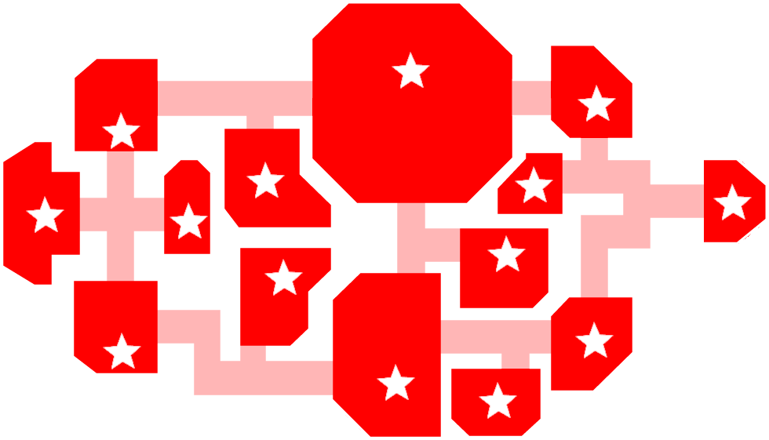
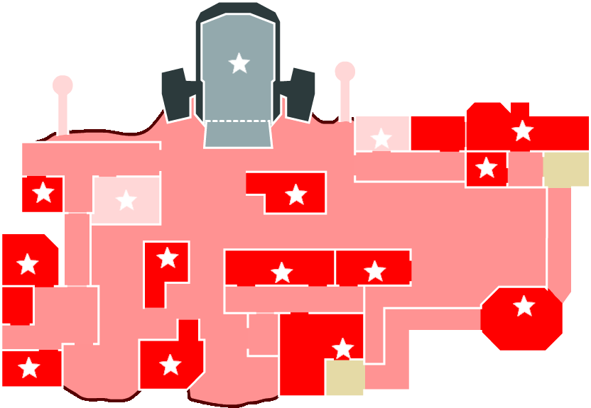
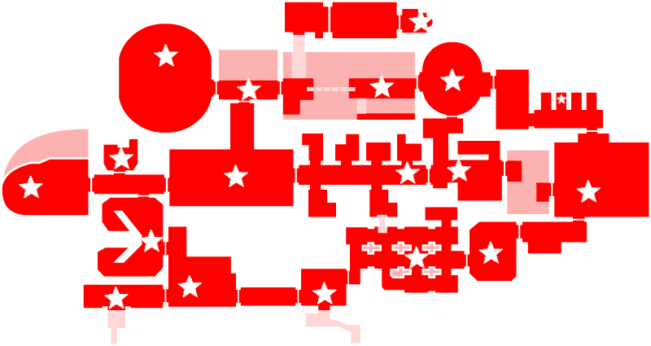

# Town Of Host

この README は英語版です。 
! We are not good at English, so if you have difficulty in making out the translation, please translate the Japanese README into English. ! 

## Regarding this mod

This mod is not affiliated with Among Us or Innersloth LLC, and the content contained therein is not endorsed or otherwise sponsored by Innersloth LLC. Portions of the materials contained herein are property of Innersloth LLC. © Innersloth LLC.

## Releases

AmongUs Version: **2023.3.28**

**Latest Version: [Here](https://github.com/tukasa0001/TownOfHost/releases/latest)**

Old Versions: [Here](https://github.com/tukasa0001/TownOfHost/releases)

## Features

This mod only needs to be installed on the host's client to work, and works regardless of whether or not other client mods have been installed, and regardless of the type of terminal. 
Unlike mods that use custom servers, there is no need to add servers by editing URLs or files. 

However, please note that the following restrictions apply. 

- If the host changes due to factors such as a host leaving in the middle of a session, the processing related to the additional role may not work properly.

Note that if a player other than the host plays with this mod installed, the following changes will be made. 

- Display of the special role's own start screen.
- Display of the normal victory screen for the special role.
- Add additional settings.
- etc.

## Announcements
- Sheriff, Arsonist, Jackal, and other roles can close doors, but please don't use it because the system can't limit it.
- The dead player chat can be seen when exile screen by anti blackout, but this is not a bug.
- The "Confirm Ejects" option will not work if any of the following roles are enabled: Sheriff, Arsonist, Jackal.

## Features
### Hotkeys

#### Host Only
| HotKey              | Function                         | Usable Scene  |
| ------------------- | -------------------------------- | ------------- |
| `Shift`+`L`+`Enter` | Force End Game                   | In Game       |
| `Shift`+`M`+`Enter` | Skip meeting to end              | In Game       |
| `Ctrl`+`N`          | Show active settings             | Lobby&In Game |
| `Ctrl`+`Shift`+`N`  | Show active settings description | Lobby&In Game |
| `C`                 | Cancel game start                | In Countdown  |
| `Shift`             | Start the game immediately       | In Countdown  |
| `Ctrl`+`RMB`        | Execute clicked player           | In Meeting    |

#### MOD Client Only
| HotKey      | Function                                                                           | Usable Scene  |
| ----------- | ---------------------------------------------------------------------------------- | ------------- |
| `Tab`       | Option list page feed                                                              | Lobby         |
| `Ctrl`+`F1` | Output log to desktop                                                              | Anywhere      |
| `F10`       | Open AmongUs folder                                                                | Anywhere      |
| `F11`       | Change resolution 480x270 → 640x360 → 800x450 → 1280x720 → 1600x900 → 1920x1080 | Anywhere      |
| `T`+`F5`    | Reload custom translation file                                                     | Anywhere      |
| `Alt`+`C`   | Copy current settings text                                                         | Lobby&In Game |
| `Ctrl`+`C`  | Copy the text                                                                      | Chat          |
| `Ctrl`+`V`  | Paste the text                                                                     | Chat          |
| `Ctrl`+`X`  | Cut the text                                                                       | Chat          |
| `↑`         | Go back in time of chat send history                                               | Chat          |
| `↓`         | Go future in time of chat send history                                             | Chat          |

### Chat Commands
You can execute chat commands by typing in chat.

#### Host Only
| Command                                     | Function                                          |
| ------------------------------------------- | ------------------------------------------------- |
| /winner /win                             | Show winner                                       |
| /rename <string> /r <string>             | Change my name                                    |
| /dis <crewmate/impostor>                    | Ending the match as a Crewmate/Impostor severance |
| /messagewait <sec> /mw <sec>             | Set message send interval                         |
| /help /h                                 | Show command description                          |
| /help roles <role> /help r <role>        | Show role description                             |
| /help addons <add-ons> /help a <add-ons> | Show add-on description                           |
| /help modes <mode> /help m <mode>        | Show mode description                             |
| /hidename <string> /hn <string>          | Rename code concealment string                    |
| /say <string>                               | Make an announcement as a host                    |

#### MOD Client Only
| Command        | Function                    |
| -------------- | --------------------------- |
| /dump          | Dump log                    |
| /version /v | Show version of MOD clients |

#### All Clients
| Command                     | Function                                |
| --------------------------- | --------------------------------------- |
| /lastresult /l           | Show game result                        |
| /killlog /kl             | Show kill log                           |
| /now /n                  | Show active settings                    |
| /now roles /n r          | Show active roles settings              |
| /help now /help n        | Show active setting descriptions        |
| /template <tag> /t <tag> | Show template text corresponding to tag |
| /myrole /m               | Display a description of your role      |
| /killlog /kl             | Show kill log                           |

### Template
This function allows you to send prepared messages. 
Execute by typing `/template <tag>` or `/t <tag>`. 
To set the text, edit `./TOH_DATA/template.txt` in the same folder as AmongUs.exe. 
Separate each entry with a colon, such as `tag:content`. 
Also, you can break lines by writing `\n` in the sentence like `tag:line breaks can be\nmade like this`. 

#### Special Tags
There are special tags that can be sent automatically according to the scene. 
For example: `welcome:This room is using TownOfHost.`

| Tag            | Scene                             | Target                     |
| -------------- | --------------------------------- | -------------------------- |
| welcome        | When the player joins the room    | Player who joined the room |
| OnMeeting      | At the start of the meeting       | Everyone                   |
| OnFirstMeeting | At the start of the First meeting | Everyone                   |

#### Variable Expansion
The contents of a variable can be expanded at the time of a call by including it in the text as `{{variable name}}`. 
For example: `roomcode:The room code for this room is {{RoomCode}}.`

| Variable name        | Content                             |
| -------------------- | ----------------------------------- |
| RoomCode             | Room Code                           |
| PlayerName           | Player name of host                 |
| AmongUsVersion       | Game version                        |
| ModVersion           | MOD version                         |
| Map                  | Map name                            |
| NumEmergencyMeetings | Number of emergency meeting buttons |
| EmergencyCooldown    | Emergency Meeting Button Cooldown   |
| DiscussionTime       | Discussion time                     |
| VotingTime           | Voting time                         |
| PlayerSpeedMod       | Player speed                        |
| CrewLightMod         | Crewmate vision                     |
| ImpostorLightMod     | Impostor vision                     |
| KillCooldown         | Kill Cooldown                       |
| NumCommonTasks       | Number of common tasks              |
| NumLongTasks         | Number of long tasks                |
| NumShortTasks        | Number of short tasks               |
| Date                 | Date                                |
| Time                 | Time                                |

### Custom Translation File
Users are free to create and use their own translations. 
- Open the "Language" folder created in the Among Us folder.
- Create a file named `{language name}.dat` in the folder
  - For example: English.dat
  - You can also rename `template.dat` or `template_English.dat` and use it.
- In the file, enter like `before translation:after translation`.
  - For example: Command.rename:Change Host Name
  - See `template.dat` for the `before translation` string.

You can also reload the translation by pressing key `T`+`F5`.

#### Supported Languages

| Language Name |
| ------------- |
| English       |
| Latam         |
| Brazilian     |
| Portuguese    |
| Korean        |
| Dutch         |
| Filipino      |
| French        |
| German        |
| Italian       |
| Japanese      |
| Spanish       |
| SChinese      |
| TChinese      |
| Irish         |

### BAN Function
The host can ban players even during the game without requiring other players to vote.  
If a player is banned, they will not be able to enter the room until it is closed.  
Players who have already left can also be added to the ban list by selecting them and pressing the ban button. 
Banned players are recorded in `./TOH_DATA/BanList.txt` as `friend code, player name`. You can remove the ban by deleting the corresponding line.  
Even if you block it with a friend list, it will automatically ban.  

### Kick Function
The host can kick players during the game without requiring other players to vote.  

### Name Filter
By listing the names you want to deny in `./TOH_DATA/DenyName.txt`, players with matching names will be automatically kicked.  
It can be specified by [regular expression](https://regex101.com/), and it will be judged line by line.  

Example:
| specified character | matching name                           | note                           |
| ------------------- | --------------------------------------- | ------------------------------ |
| Host                | `Host` `MODHost` `HostTOH` `MODHostTOH` | Matches if `Host' is included. |
| ^Host               | `HostMOD` `HostTOH` `HostTEST`          | Match if prefixed with `Host`  |
| Host$               | `MODHost` `TOHHost` `TESTHost`          | Match if postfixed with `Host` |
| ^Host$              | `Host`                                  | Exact match to `Host`          |

## Roles

| Impostors                           | Crewmates                         | Neutrals                          | Add-Ons                       | Others    |
| ----------------------------------- | --------------------------------- | --------------------------------- | ----------------------------- | --------- |
| [BountyHunter](#BountyHunter)       | [Bait](#Bait)                     | [Arsonist](#Arsonist)             | [LastImpostor](#LastImpostor) | [GM](#GM) |
| [EvilTracker](#EvilTracker)         | [Dictator](#Dictator)             | [Egoist](#Egoist)                 | [Lovers](#Lovers)             |           |
| [FireWorks](#FireWorks)             | [Doctor](#Doctor)                 | [Executioner](#Executioner)       | [Watcher](#Watcher)           |           |
| [Mare](#Mare)                       | [Lighter](#Lighter)               | [Jackal](#Jackal)                 | [Workhorse](#Workhorse)       |           |
| [Puppeteer](#Puppeteer)             | [Mayor](#Mayor)                   | [Jester](#Jester)                 |                               |           |
| [SerialKiller](#SerialKiller)       | [SabotageMaster](#SabotageMaster) | [Opportunist](#Opportunist)       |                               |           |
| [ShapeMaster](#ShapeMaster)         | [Seer](#Seer)                     | [Terrorist](#Terrorist)           |                               |           |
| [Sniper](#Sniper)                   | [Sheriff](#Sheriff)               | [SchrodingerCat](#SchrodingerCat) |                               |           |
| [TimeThief](#TimeThief)             | [Snitch](#Snitch)                 |                                   |                               |           |
| [Vampire](#Vampire)                 | [SpeedBooster](#SpeedBooster)     |                                   |                               |           |
| [Warlock](#Warlock)                 | [Beartrap](#Beartrap)             |                                   |                               |           |
| [Witch](#Witch)                     | [TimeManager](#TimeManager)       |                                   |                               |           |
| [Mafia](#Mafia)                     |                                   |                                   |                               |           |
| [Madmate](#Madmate)                 |                                   |                                   |                               |           |
| [MadGuardian](#MadGuardian)         |                                   |                                   |                               |           |
| [MadSnitch](#MadSnitch)             |                                   |                                   |                               |           |
| [SidekickMadmate](#SidekickMadmate) |                                   |                                   |                               |           |

### GM

The GM (Game Master) is an observer role. 
Their presence has no effect on the game itself, and all players know who the GM is at all times. 
Always assigned to a host and is ghosted from the start. 

## Impostor

### AntiAdminer

Create by Yumeno 

Team : Impostors 
Basis : Impostor 

AntiAdminer can tell if someone is in front of the Admin，Door Log，or Vital equipment.  
It does not know if the person is actually using the equipment. 

#### Game Options

| Name                          |
| ----------------------------- |
| Can Check Camera              |

### BountyHunter

Team : Impostors 
Basis : Shapeshifter 

If the BountyHunters kill their designated target, their next kill cooldown will be much less than usual. 
Killing a player except their current target results in an increased kill cooldown. 
The target swaps after a configurable amount of time. 

#### Game Options

| Name                                  |
| ------------------------------------- |
| Time To Swap Bounty(s)                |
| Kill Cooldown After Killing Bounty(s) |
| Kill Cooldown After Killing Others(s) |
| Show arrow pointing to target         |

### EvilTracker

Team : Impostors 
Basis : Shapeshifter 

EvilTrackers can track other players. 
They have arrows pointing to the other impostors and to another player selected by shapeshift. 
Depending on option, they can also see kill flash when other impostor kills. 

- EvilTrackers can select a target after every meeting or once in a game, when marked left-triangle (◁).
- When they Shapeshift to impostor or dead player (unavailable for target), they stay able to select target.
- Shapeshift cooldown is fixed to __"5s"__ (can select target) or to __"255s"__ (cannot).
- Shapeshift duration is fixed to __"1s"__, which means EvilTrackers can hardly pretend to be someone else.
- EvilTrackers can Assign [SidekickMadmate](#SidekickMadmate) by Shapeshift.

#### Game Options

| Name                                            |
| ----------------------------------------------- |
| EvilTracker Can See The Flash Of Impostor Kills |
| EvilTracker Can Reset Target After Meeting      |

### FireWorks

Create and idea by こう。 

Team : Impostors 
Basis : Shapeshifter 

The FireWorks can set off fireworks and kill all at once.  
They can put a few fireworks by Shapeshift.  
After they put all the fireworks and after the other impostors are all gone, they can ignite all fireworks at once by Shapeshift.  
They can perform kills after setting off fireworks.  
Even if they mistakenly bomb themselves, killing everyone results in Impostor win.  

#### Game Options

| Name                |
| ------------------- |
| FireWorks Max Count |
| FireWorks Radius    |

### Mare

Create by Kihi, しゅー, そうくん, ゆりの 
Idea by Kihi

Team : Impostors 
Basis : Impostor 

The Mare can kill only in lights out, but next kill cooldown will be half. 
While lights are out they can move faster, but everyone sees their name in red. 

#### Game Options

| Name                                |
| ----------------------------------- |
| Mare Player Add Speed In Lights Out |
| Mare Kill Cooldown In Lights Out    |

### Puppeteer

Team : Impostors 
Basis : Impostor 

The Puppeteer can curse a crewmate and force them to kill the next non-impostor they come near. 
The cursed crewmate can also kill a mad role. 
It is not possible for puppeteer to perform a normal kill. 

### SerialKiller

Team : Impostors 
Basis : Shapeshifter 

The SerialKillers have a shorter kill cooldown. 
Unless they kill before the time runs out, they kill themselves instantly. 

#### Game Options

| Name                          |
| ----------------------------- |
| SerialKiller Kill Cooldown(s) |
| Time Limit To Suicide(s)      |

### ShapeMaster

Create and idea by しゅー 

Team : Impostors 
Basis : ShapeShifter 

The ShapeMasters have no Shapeshift cooldown. 
On the other hand, their default Shapeshift duration is shorter (default: 10s). 

#### Game Options

| Name                   |
| ---------------------- |
| Shapeshift Duration(s) |

### Sniper

Create and idea by こう。 

Team : Impostors 
Basis : Shapeshifter 

Sniper can shoot players from far away.  
They kill a player on the extension line from Shapeshift point to release point. 
Players in the line of the bullet hear the sound of a gunshot. 
You can perform normal kills after all bullets run out. 

Precise Shooting:OFF 
 
Precise Shooting:ON 
 

Aim Assist 
When you stop while aiming, a mark will appear if there is a target in the line of fire. 
If it is a one shot assist, it will disappear immediately. 

#### Game Options

| Name                    |
| ----------------------- |
| Sniper Bullet Count     |
| Sniper Precise Shooting |
| Sniper Aim Assist       |
| Sniper One shot Assist  |

### TimeThief

Created by integral, しゅー, そうくん, ゆりの 
Idea by みぃー 

Team : Impostors 
Basis : Impostor 

Every kill cuts down discussion and voting time in meeting. 
Depending on options, the lost time is returned after they die. 

#### Game Options

| Name                              |
| --------------------------------- |
| TimeThief Decrease Time Length(s) |
| Lower Limit For Voting Time(s)    |
| Return Stolen Time After Death    |

### Vampire

Team : Impostors 
Basis : Impostor 

When the vampire kills, the kill is delayed (the bitten player will die in a set time based on settings or when the next meeting is called). 
If the vampire bites [Bait](#Bait), the player will die immediately and a self-report will be forced. 

#### Game Options

| Name                  |
| --------------------- |
| Vampire Kill Delay(s) |

### Warlock

Team : Impostors 
Basis : Shapeshifter 

When a warlock presses kill, the target is cursed.  
The next time the warlock shifts, the cursed player will kill the nearest person. 
If you shapeshift as Warlock, you can make a regular kill.  
Beware, if you or another impostor are the nearest to the player you have cursed when you shift you will be killed. 

### Witch

Team : Impostors 
Basis : Impostor 

The Witches can perform kills or spells switched by Actions. 
In Double Click mode, Single Click for spell, Double Clicks for kill. 
The players spelled by Witches before a meeting are marked "cross" in the meeting, and unless exiling Witches, they all die just after the meeting. 
If the witch dies other than by exile, the curse is not lifted. 

#### Game Options

| Name               |                        |
| ------------------ | ---------------------- |
| Mode Switch Action | Kill/Vent/Double Click |

### Mafia

Team : Impostors 
Basis : Impostor 

The Mafias can initially use vents and sabotage, but cannot kill (still have a button). 
They will be able to kill after all Impostors except them are all gone. 

## Madmate

There are common options for Madmates.
#### Game Options

| Name                                    |
| --------------------------------------- |
| Madmates Can Fix Lights Out             |
| Madmates Can Fix Comms                  |
| Madmates Have Impostor Vision           |
| Madmates Can See Kill Flash             |
| Madmates Can See Other Votes            |
| Madmates Can See Cause Of Death         |
| Madmates Revenge A Crewmate When Exiled |
| Madmates Vent Cooldown                  |
| Madmates Max Time In Vents              |

### Madmate

Team : Impostors 
Basis : Engineer 
Count : Crew 

The Madmates belong to team Impostors, but they don't know who the Impostors are. 
Impostors don't know Madmates either. 
They cannot kill or sabotage, but they can use vents. 

### MadGuardian

Create and idea by 空き瓶/EmptyBottle 

Team : Impostors 
Basis : Crewmate 
Count : Crew 

The MadGuardians belong to team Impostors, one type of Madmates. 
Compared with Madmates, MadGuardian cannot use vents, while they can guard kills by Impostors after finishing all tasks. 

#### Game Options

| Name                                  |
| ------------------------------------- |
| MadGuardian Can See Who Tried To Kill |

### MadSnitch

Create and idea by そうくん 

Team : Impostors 
Basis : Crewmate or Engineer 
Count : Crew 

The MadSnitches belong to team Impostors, one type of Madmates. 
They can see who is the Impostor after finishing all their tasks. 
Depending on option, they can use vents. 

#### Game Options

| Name                     |
| ------------------------ |
| MadSnitch Can Use Vent   |
| Also Exposed To Impostor |
| MadSnitch Tasks          |

### SidekickMadmate

Create and idea by たんぽぽ 

Team : Impostors 
Basis : Undecided 
Count : Crew 

The SidekickMadmate is an acquired Madmate Role assigned by Impostors in task phases. 
Some kind of Shapeshifter-based Impostors can give SidekickMadmate by Shapeshifting next to a target. 

**NOTE:**
- The **"nearest"** Crewmate becomes SidekickMadmate no matter to whom the Impostors Shapeshift.

## Crewmate

### Bait

Team : Crewmates 
Basis : Crewmate 

When Bait is killed, the imposter will automatically self report. 
This also applies to delayed kills- Once the kill button is pressed, the report will be immediate. 

### Dictator

Create and idea by そうくん 

Team : Crewmates 
Basis : Crewmate 

When voting for someone in a meeting, the Dictators forcibly break that meeting and exile the player they vote for. 
After exercising the force, the Dictators die just after meeting. 

### Doctor

Team : Crewmates 
Basis : Scientist 

The doctor can see when Crewmates die using vitals anywhere in the map. 
By closing the chat, the doctor can see the dead players cause of death next to their name for all meetings. 

#### Game Options
| Name                    |
| ----------------------- |
| Doctor Battery Duration |

### Lighter

Team : Crewmates 
Basis : Crewmate 

After finishing all the task, The lighters have their vision expanded and ignore lights out. 

#### Game Options

| Name                          |
| ----------------------------- |
| Lighter Expanded Vision       |
| Lighter Gains Impostor Vision |

### Mayor

Team : Crewmates 
Basis : Crewmate or Engineer 

The Mayor's votes count twice or more. 
Depending on the options, they can call emergency meeting by entering vents. 

#### Game Options

| Name                                |
| ----------------------------------- |
| Mayor Additional Votes Count        |
| Mayor Has Mobile Emergency Button   |
| ┗ Number Of Mobile Emergency Button |

### SabotageMaster

Create and idea by 空き瓶/EmptyBottle 

Team : Crewmates 
Basis : Crewmate 

The SabotageMasters can fix sabotages faster. 
They can fix both of Comms in MIRA HQ, Reactor and O2 by fixing either. 
Lights can be fixed by touching a single lever. 
Opening a door in Polus or The Airship will open all the linked doors. 

#### Game Options

| Name                                                   |
| ------------------------------------------------------ |
| SabotageMaster Fix Ability Limit(Except Opening Doors) |
| SabotageMaster Can Open Multiple Doors                 |
| SabotageMaster Can Fix Both Reactors                   |
| SabotageMaster Can Fix Both O2                         |
| SabotageMaster Can Fix Both Comms In MIRA HQ           |
| SabotageMaster Can Fix Lights Out All At Once          |

### Seer

Team : Crewmates 
Basis : Crewmate 

Seers can see when someone dies. 
For an instant, their vision turns totally dark and a Reactor alert will appear only to them unless Reactor is active (named "Kill Flash"). 
For the host, the screen flash red and a kill sounds. 
There is an option to slightly adjust Kill Flash duration. 

#### Game Options

| Common Options         |
| ---------------------- |
| Kill Flash Duration(s) |

### Sheriff

Team : Crewmates 
Basis : Impostor(Only host is the Crewmate) 
Count : Crew 

Sheriff can kill imposters. 
Depending on settings, Sheriff may also kill neutrals. 
The sheriff has no tasks. 
Killing Crewmates will result in suicide.  

* As a measure against blackout, after death, the Sheriff can only see the motion of committing suicide at each meeting. There is no corpse.  

#### Game Options

| Name                                                                |
| ------------------------------------------------------------------- |
| Kill Cooldown                                                       |
| Sheriff Can Kill Crewmates As It                                    |
| Sheriff Shot Limit                                                  |
| Sheriff Can Kill Madmates                                           |
| Sheriff Can Kill Neutrals                                           |
| ┣ Sheriff Can Kill [Jester](#Jester)                                |
| ┣ Sheriff Can Kill [Terrorist](#Terrorist)                          |
| ┣ Sheriff Can Kill [Opportunist](#Opportunist)                      |
| ┣ Sheriff Can Kill [Arsonist](#Arsonist)                            |
| ┣ Sheriff Can Kill [Egoist](#Egoist)                                |
| ┣ Sheriff Can Kill [SchrodingerCat](#SchrodingerCat) In Team Egoist |
| ┣ Sheriff Can Kill [Executioner](#Executioner)                      |
| ┣ Sheriff Can Kill [Jackal](#Jackal)                                |
| ┗ Sheriff Can Kill [SchrodingerCat](#SchrodingerCat) In Team Jackal |

### Snitch

Team : Crewmates 
Basis : Crewmate 

Once all of the snitch's tasks are completed, the imposters names will be displayed in red. 
Dependent on the settings, the snitch may also see arrows pointed in the remaining impostors directions when their tasks are completed. 
When the amount of remaining tasks in a snitch falls below a set amount, the imposter displays a star next to the snitch's name. 
The imposter also displays an arrow in the direction of the snitch. 

#### Game Options

| Name                           |
| ------------------------------ |
| Snitch Can See Target Arrow    |
| Snitch Can See Colored Arrow   |
| Snitch Can Find Neutral Killer |
| Remaining tasks to be found    |

### SpeedBooster

Create and idea by よっキング 

Team : Crewmates 
Basis : Crewmate 

Defined amount of tasks boosts the player speed of someone alive. 

#### Game Options

| Name                |
| ------------------- |
| Acceleration valued |
| Tasks that trigger  |

### Beartrap

Created by そうくん 
Original idea by 宿主ランニング 

Team : Crewmates 
Basis : Crewmate 

When killed, the Beartrap will hold the killer in place. 
Also, if a report is made while in custody, it will be canceled and the report will be made after the release. 
The time held in place on the body is decided by host in settings. 

Rename [Trapper] -> [Beartrap]
the word contains prohibited characters

#### Game Options

| Name            |
| --------------- |
| Freeze Duration |

### TimeManager

Created by じゅきまぐろ 
Original idea by おしゅし 

Team : Crewmates 
Basis : Crewmate 

The more tasks you do, the longer your meeting will last. 
When you die, the meeting time will be restored. 

#### Game Options

| Name                 |
| -------------------- |
| Increase Voting Time |
| Increase Limit       |

## Neutral

#### Settings

| Settings Name   |
| --------------- |
| Block Move Time |

### Arsonist

Team : Neutral(Solo) 
Basis : Impostor 
Count : Crew 
Victory Condition : Douse and ignite all the living players 

When an arsonist tries to use the kill button, they douse oil onto the crewmates. 
To win as Arsonist, you must douse all players and vent to win. 
To douse, you must stand next to a player after pressing kill until the orange triangle is filled in. 

* As a measure against blackout, after death, the Arsonist can only see the motion of committing suicide at each meeting. There is no corpse.  

#### Game Options

| Name                    |
| ----------------------- |
| Arsonist Douse Duration |
| Arsonist Douse Cooldown |

### Egoist

Create by そうくん 
Original idea by しゅー 

Team : Neutral(Egoist) 
Basis : Shapeshifter 
Count : Impostor 
Victory Condition : Satisfy the Impostor victory condition after all the Impostors die. 

The Egoists are counted among the Impostors. 
They have the same ability as Shapeshifters. 
Impostors and Egoists can see but cannot kill each other. 
The Egoists have to exile all Impostors before leading to Impostor win. 
Egoist win means Impostor lose and vice versa. 

**NOTE:**
- The Egoists lose in the following condition: 
1. Egoist dies. 
2. Impostor win with some Impostors remained. 
3. Crewmate or other Neutral win. 

#### Settings

| Settings Name       |
| ------------------- |
| Egoist KillCooldown |

### Executioner

Team : Neutral(Solo) 
Basis : Crewmate 
Count : Crew 
Victory Conditions : Have the target voted out 

Executioner’s target is is marked with a diamond which only they can see. 
If the executioner’s target is voted off, they win alone. 
If the target is a [Jester](#jester), they will win an additional victory with the executioner. 

#### Game Options

| Name                                    |
| --------------------------------------- |
| Executioner Can Target Impostor         |
| Executioner Can Target Neutral Murderer |
| Role After Target Dies                  |

### Jackal

Team : Neutral(Jackal) 
Basis : Impostor 
Count : Jackal 
Victory Condition : Annihilate all Imposters and the number of Jackal teams must equal or exceed the number of crew members 
Create by 空き瓶/EmptyBottle 

The Jackal is part of an extra team, that tries to eliminate all the other players. 
The Jackal has no tasks and can kill Impostors, Crewmates and Neutrals. 

The team Jackal enables multiple new outcomes of the game, listing some examples here: 
- The Impostors could be eliminated and then the crew plays against the team Jackal. 
- The Crew could be eliminated, then the Team Jackal fight against the Impostors (The Crew can still make a task win in this scenario) 

If both Impostors and Jackals are in the game, the game continues even if all Crewmates are dead.  
Crewmates may still win in this case by completing their tasks. Jackal and Impostor have to kill each other. 

・In the case of 1 Impo & Jackal, even if it is banished by vote, it will be displayed as No one was banished 
  It is not a bug that is displayed like this as a countermeasure against blackout. 
・ Auto mute is removed when impo is hung 

### Game Options

| Name                |
| ------------------- |
| Kill Cooldown       |
| Can Use Vent        |
| Can Sabotage        |
| Has Impostor Vision |

### Jester

Team : Neutral(Solo) 
Basis : Crewmate 
Count : Crew 
Victory Conditions : Get voted out 

The Jesters don't have any tasks. They win the game as a solo, if they get voted out during a meeting. 
Remaining alive until the game end or getting killed results Jester lose. 

### Opportunist

Team : Neutral(Other) 
Basis : Crewmate 
Count : Crew 
Victory Conditions : Remain alive until the game end 

Regardless of the games outcome, Opportunist wins an additional victory if they survive to the end of the match. 

### SchrodingerCat

Team : Neutral(Other) 
Basis : Crewmate 
Count : Crew 
Victory Conditions : None 

The SchrodingerCats have no tasks and by default, no victory condition. Only after fulfiling the following condition they obtain victory conditions. 

1. If killed by **Impostors**, they prevent the kill and belong to **team Impostors**. 
2. If killed by [Sheriff](#sheriff), they prevent the kill and belong to **team Crewmate**. 
3. If killed by **Neutral**, they prevent the kill and belong to the **Neutral team**. 
4. If exiled, they die with the victory condition same as before. 
5. If killed with special abilities of Impostors (except for [Vampire](#vampire)), they die with the victory condition same as before. 

#### Game Options

| Name                                             |
| ------------------------------------------------ |
| SchrodingerCat In No Team Can Win With Crewmates |
| Team To Change After Exiled                      |

### Terrorist

Create and original idea by 空き瓶/EmptyBottle 

Team : Neutral(Solo) 
Basis : Engineer 
Count : Crew 
Victory Conditions : Finish All Tasks, Then Die 

The Terrorists are the Neutral Role where they win the game alone if they die with all their tasks completed. 
Any cause of death is acceptable. 
If they die before completing their tasks, or if they survive at the game end, they lose. 

## Add-Ons

### LastImpostor

Create and idea by そうくん 

An Add-on given to the last Impostor. 
kill cooldown gets shorter than usual. 
Not assigned to [BountyHunter](#bountyhunter), [SerialKiller](#serialkiller), or [Vampire](#vampire). 

#### Game Options

| Name                       |
| -------------------------- |
| LastImpostor Kill Cooldown |

### Lovers

Create and idea by ゆりの 

Team : Neutral(Lovers) 
Basis : - 
Count : - 
Victory Conditions : Alive at the end of the game. (other than task completion) 

Randomly assigned to two players (regardless of camp). 
This is a third camp in which both players win or die alongside one another. 
If your lover wins, you win. 
If your lover dies, you die. 
If the crewmates win by tasks, the lovers lose. 
The lovers can also win if both are still alive at the end of the game and the crewmates don't win by tasks. 
If the lovers win, everyone else loses. 
Crewmate lovers are assigned tasks, but are not counted in task completion. Abilities can be used. 

Example of overlapping Roles:  
- [Terrorist](#terrorist) Lover: You have tasks and If you die after completing the task, you will win as a terrorist.  
- [MadSnitch](#madsnitch) Lover: You have tasks, and you can see the Impostor after completing the task.  
- [Snitch](#snitch) Lover: You have tasks, and you can see the Impostor after completing the task.  
- [Sheriff](#sheriff) Lover: You can kill Impostors as usual. Whether or not you can kill depends on Roles and Options. (Impostor Lover can be killed. Crewmate Lover cannot be killed)  
- [Opportunist](#opportunist) Lover: Win if you survive.  
- [Jester](#jester) Lover: If you are voted out, you will win as Jester. If the other Lover is voted out, you are defeated.  
- [Bait](#bait) Lover: When the other Lover is killed and you die afterwards, the other Lover immediately reports you.  

### Watcher

Target : Crewmates, Impostors, Neutrals[(*)](#add-ons-assignment-options)

The watcher can see who each player has voted during every meeting.

### Workhorse

Create and idea by Masami 

An Add-on granted to the first living Crewmate finishing all the tasks. 
You are assigned additional tasks necessary for the tasks win. 
Never granted to Sheriff or Snitch. 

#### Game Options

| Name                    |
| ----------------------- |
| Assign Only To Crewmate |
| Additional Long Tasks   |
| Additional Short Tasks  |

### Add-Ons Assignment Options

Some add-ons have common assignment options.  
Some add-ons have restrictions on the teams that can be assigned.  

#### Options

| Name                          |                                                               |
| ----------------------------- | ------------------------------------------------------------- |
| Max                           | Maximum number of total                                       |
| Max Players In Team Crewmates | The portion of the Max to be assigned to the crewmates (0-15) |
| ┣ Fixed Role                  | Limit the role to be assigned                                 |
| ┃ ┗ Role                      | The role to be assigned                                       |
| Max Players In Team Impostors | (0-3)                                                         |
| ┣ Fixed Role                  |                                                               |
| ┃ ┗ Role                      |                                                               |
| Max Players In Neutral        | (0-15)                                                        |
| ┣ Fixed Role                  |                                                               |
| ┃ ┗ Role                      |                                                               |

#### Assignment Algorithm

1. Determine the total number to assign from probabilities and "Max" options
1. Determine players in the target roles according to the maximum numbers for each team
1. Determine the target player randomly according to the maximum number of total

#### Examples

1. Assign to one player randomly from the crew team  
Max: 1, Max Players: (1, 0, 0)
1. Assign to all n impostors  
Max: n, Max Players: (0, n, 0)
1. Assign to a Jackal fixedly  
Max: 1, Max Players: (0, 0, 1), Fixed Role(Neutral): ON, Role: Jackal
1. Assign to n players from all players  
Max: 1, Max Players: (15, 3, 15)

## Assign Algorithm Mode

Sets how roles are assigned. 

| Settings Name            |
| ------------------------ |
| Assign Algorithm Mode    |
| ┣ Minimum Impostor Roles |
| ┣ Maximum Impostor Roles |
| ┣ Minimum Mad Roles      |
| ┣ Maximum Mad Roles      |
| ┣ Minimum Crewmate Roles |
| ┣ Maximum Crewmate Roles |
| ┣ Minimum Neutral Roles  |
| ┗  Maximum Neutral Roles |

## DisableDevices

Various devices can be disabled.

| Settings Name                   |
| ------------------------------- |
| Disable Skeld Devices           |
| ┣ Disable Admin                 |
| ┗ Disable Camera                |
| Disable MiraHQ Devices          |
| ┣ Disable Admin                 |
| ┗ Disable DoorLog               |
| Disable Polus Devices           |
| ┣ Disable Admin                 |
| ┣ Disable Camera                |
| ┗ Disable Vital                 |
| Disable Airship Devices         |
| ┣ Disable Airship Cockpit Admin |
| ┣ Disable Airship Records Admin |
| ┣ Disable Camera                |
| ┗ Disable Vital                 |
| Ignore Conditions               |
| ┣ Ignore Impostors              |
| ┣ Ignore Madmates               |
| ┣ Ignore Neutrals               |
| ┣ Ignore Crewmates              |
| ┗ Ignore After Anyone Died      |

## SabotageTimeControl

The time limit for some sabotage can be modified.

| Name                        |
| --------------------------- |
| Modify Sabotage TimeLimit   |
| ┣ Polus Reactor TimeLimit   |
| ┗ Airship Reactor TimeLimit |

## Map Modifications

### AirShip Variable Electrical

The structure of the Electrical in AirShip changes after every meeting. 

| Name                         |
| ---------------------------- |
| Variable Electrical(AirShip) |

### Disable Moving Platform

Disable the moving platform in Airship.

| Name                             |
| -------------------------------- |
| Disable Moving Platform(Airship) |

## Mode

### DisableTasks

It is possible to not assign certain tasks. 

| Name                          |
| ----------------------------- |
| Disable Tasks                 |
| ┣ Disable StartReactor Tasks  |
| ┣ Disable SubmitScan Tasks    |
| ┣ Disable SwipeCard Tasks     |
| ┣ Disable UnlockSafe Tasks    |
| ┣ Disable UploadData Tasks    |
| ┗ Disable ResetBreakers Tasks |

### Fall from ladders

There is a configurable probability of fall to death when you descend from the ladder. 

| Name                   |
| ---------------------- |
| Fall From Ladders      |
| ┗ Fall To Death Chance |

### HideAndSeek

Create and idea by 空き瓶/EmptyBottle 

#### Crewmates Team (Blue) Victory Conditions

Completing all tasks. 
※Ghosts' tasks are not counted. 

#### Impostor Team (Red) Victory Conditions

Killing all Crewmates. 
※Even if there are equal numbers of Crewmates and Impostors, the match will not end unless all the Crewmates are killed. 

#### Fox (Purple) Victory Conditions

Staying alive when one of the teams (Except Troll) wins. 

#### Troll (Green) Victory Conditions

Killed by Impostors. 

#### Prohibited items

- Sabotage 
- Admin 
- Camera 
- Exposing by ghosts 
- Ambush (This may make it impossible for Crewmates to win with the tasks.) 

#### What you can't do

- Reporting a dead bodies 
- Emergency meeting button 
- Sabotage 

#### Game Options

| Name                      |
| ------------------------- |
| Allow Closing Doors       |
| Impostors Waiting Time(s) |
| Ignore Cosmetics          |
| Disable Vents             |

### NoGameEnd

#### Crewmates Team Victory Conditions

None 

#### Impostor Team Victory Conditions

None 

#### Prohibited items

None 

#### What you can't do

Exiting the game with anything other than host's SHIFT+L+Enter. 

This is a debug mode with no win Basis. 

### RandomSpawn

Randomize the spawn position. 

#### Game Options

| Name                        |
| --------------------------- |
| Random Spawn                |
| ┗ Additional Spawn(Airship) |

#### The Skeld

#### MiraHQ

#### Polus

#### The AirShip

If `Additional Spawn(Airship)` is OFF, the spawn will be selected only from the original spawn position.

### RandomMapsMode

Created by つがる 

The RandomMapsMode changes the maps at random. 

#### Game Options

| Name                  |
| --------------------- |
| RandomMapsMode        |
| ┣ Include The Skeld   |
| ┣ Include MIRA HQ     |
| ┣ Include Polus       |
| ┗ Include The Airship |

### SyncButtonMode

This mode limits the maximum number of meetings that can be called in total. 

#### Game Options

| Name               |
| ------------------ |
| SyncButtonMode     |
| ┗ Max Button Count |

### VoteMode

| Name             | Description                         |
| ---------------- | ----------------------------------- |
| VoteMode         |                                     |
| ┣ When Skip Vote | Default/Suicide/SelfVote            |
| ┣ When Non-Vote  | Default/Suicide/SelfVote/Skip       |
| ┗ When Tie       | Default/Exile Them All/Exile Random |

## OtherSettings

| Name                               |
| ---------------------------------- |
| All Alive Meeting                  |
| ┗ All Alive Meeting Time           |
| Additional Emergency Cooldown      |
| ┣ Survivor Threshold To Be Applied |
| ┗ Additional Cooldown              |
| Hide And Seek with Roles           |
| ┗ Waiting Time                     |
| Auto Display Last Result           |
| Suffix                             |
| Color Name Mode                    |
| Fix Kill Cooldown For First Spawn  |
| Ghost Can See Other Roles          |
| Ghosts Can See Other Tasks         |
| Ghost Can See Other Votes          |
| Ghost Can See Cause Of Death       |
| Ghost Ignore Tasks                 |
| Camouflage During Comms            |
| Disable Task Win                   |
| Hide Game Settings                 |

#### Client Settings

## Hide Codes

Turning on Streamer Mode enables this.

You can rewrite the`Hide Game Code Name`in the config file (BepInEx\config\com.emptybottle.townofhost.cfg) to display any character you like as code mask.
You can also change the text color as you like by rewriting`Hide Game Code Color`.

## Force Japanese

Activating forces the menu to be in Japanese, regardless of the language setting.

## Japanese Role Name

By activating, the Role name can be displayed in Japanese.
If the client language is English, this option is meaningless unless `Force Japanese` is enabled.

## Credits

More tips to modding and [BountyHunter](#BountyHunter),[Mafia](#Mafia),[Vampire](#Vampire),[Witch](#Witch),[Bait](#Bait),[Mayor](#Mayor),[Sheriff](#Sheriff),[Snitch](#Snitch),[Lighter](#Lighter),[Seer](#Seer),[Jackal](#jackal) idea by [The Other Roles](https://github.com/TheOtherRolesAU/TheOtherRoles) 
[Opportunist](#Opportunist),[Watcher](#Watcher) original idea by [The Other Roles: GM Edition](https://github.com/yukinogatari/TheOtherRoles-GM) 
[SchrodingerCat](#SchrodingerCat),[EvilTracker](#EvilTracker) idea by [The Other Roles: GM Haoming Edition](https://github.com/haoming37/TheOtherRoles-GM-Haoming) 
[Doctor](#Doctor) and [Sniper](#Sniper) original idea by [Nebula on the Ship](https://github.com/Dolly1016/Nebula) 
[Jester](#Jester) and [Madmate](#Madmate) original idea by [au.libhalt.net](https://au.libhalt.net) 
[Terrorist](#Terrorist)(Trickstar + Joker) : [Foolers Mod](https://github.com/MengTube/Foolers-Mod) 
[Lovers](#lovers) : [Town-Of-Us-R](https://github.com/eDonnes124/Town-Of-Us-R) 
Translate-Chinese : fivefirex, ZeMingOH233 
OptionTab Icon Design by 花海. 
Csv: Copyright (c) 2015 Steve Hansen [MIT License](https://raw.githubusercontent.com/stevehansen/csv/master/LICENSE) 
Mersenne Twister: Copyright (c) 2015 vpmedia [MIT License](https://raw.githubusercontent.com//vpmedia/template-unity/master/LICENSE) 

Translated with https://www.deepl.com 

## Developers
- [EmptyBottle](https://github.com/tukasa0001) ([Twitter](https://twitter.com/XenonBottle))
- [Tanakarina](https://github.com/tanakanira0118) <!--([Twitter](https://twitter.com/))-->
- [Shu-](https://github.com/shu-TownofHost) ([Twitter](https://twitter.com/Shu_kundayo))
- [kihi](https://github.com/Kihi1120) <!--([Twitter](https://twitter.com/))-->
- [TAKU_GG](https://github.com/TAKUGG) ([Twitter](https://twitter.com/TAKUGGYouTube1), [Youtube](https://www.youtube.com/c/TAKUGG))
- [Soukun](https://github.com/soukunsandesu) ([Twitter](https://twitter.com/Soukun_Dev), [Youtube](https://www.youtube.com/channel/UCsCOqxmXBVT-BD_UKaXpUPw))
- [Mii](https://github.com/mii-47) <!--([Twitter](https://twitter.com/))-->
- [Tampopo](https://github.com/tampopo-dandelion) ([Twitter](https://twitter.com/2nomotokaicho),  [Youtube](https://www.youtube.com/channel/UC8EwQ5gu-qyxVxek0jZw1Tg), [ニコニコ](https://www.nicovideo.jp/user/124305243))
- [Kou](https://github.com/kou-hetare) <!--([Twitter](https://twitter.com/))-->
- [Yurino](https://github.com/yurinakira) <!--([Twitter](https://twitter.com/))-->
- [Masami](https://github.com/Masami4711) <!--([Twitter](https://twitter.com/))-->
- [Juki](https://github.com/jukimaguro1) ([Twitter](https://twitter.com/jukimaguro_new))
- [HYZE](https://github.com/Hyz-sui) ([Twitter](https://twitter.com/Hyze_suisui))

Translated with https://www.deepl.com 
