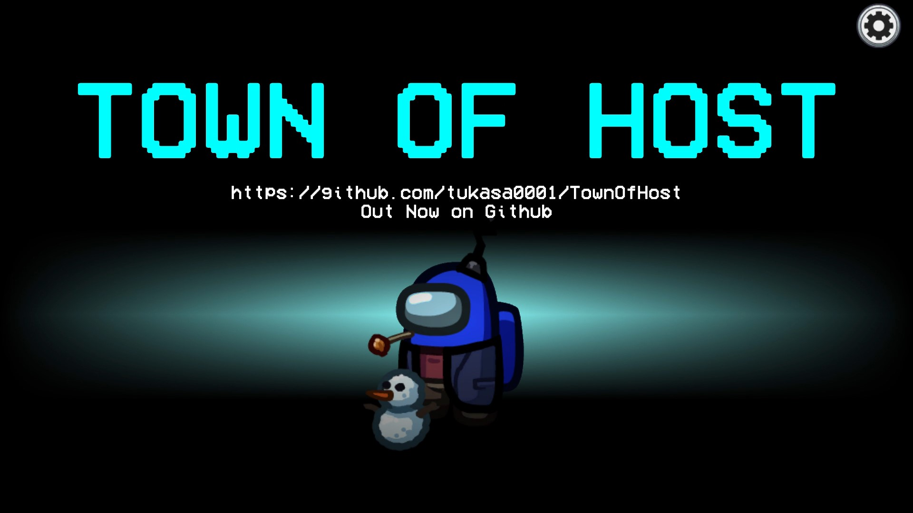
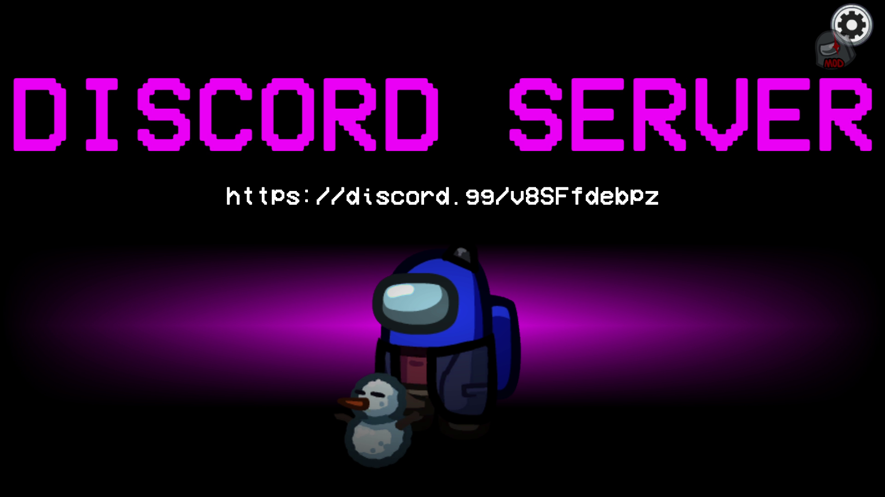

# Town Of Host

この README は英語版です。 
! My English isn't very good, so if this readme is wrong, please use Google Translator to Japanese readme. ! 

## Regarding this mod

This mod is unofficial, and Innersloth, the developer of Among Us, has no involvement in the development of this mod. 
Please do not contact the official team regarding any issues with this mod. 

## Releases

**Latest Version: [Here](https://github.com/tukasa0001/TownOfHost/releases/latest)**

Old Versions: [Here](https://github.com/tukasa0001/TownOfHost/releases)

## Features

This mod only needs to be installed on the host's client to work, and works regardless of whether or not other client mods have been installed, and regardless of the type of terminal. 
Unlike mods that use custom servers, there is no need to add servers by editing URLs or files. 

However, please note that the following restrictions apply. 

- If the host changes due to factors such as a host leaving in the middle of a session, the processing related to the additional role may not work properly.
- If a special role is used, the settings for that special role will be rewritten. (Example : Remove cooldown for vent, etc.)

Note that if a player other than the host plays with this mod installed, the following changes will be made. 

- Display of the special role's own start screen.
- Display of the normal victory screen for the special role.
- Add additional settings.
- etc.

## Features
### Hotkeys

#### All Clients
| HotKey      | Function                                                               | Usable Scene |
| ----------- | ---------------------------------------------------------------------- | ------------ |
| `Tab`       | Option list page feed                                                  | Lobby        |
| `Ctrl`+`F1` | Output log to desktop                                                  | Anywhere     |
| `F11`       | Change resolution 480x270 → 640x360 → 800x450 → 1280x720 → 1600x900 | Anywhere     |
| `Ctrl`+`C`  | Copy the text                                                          | Chat         |
| `Ctrl`+`V`  | Paste the text                                                         | Chat         |
| `Ctrl`+`X`  | Cut the text                                                           | Chat         |

#### Host only
| HotKey              | Function                      | Usable Scene  |
| ------------------- | ----------------------------- | ------------- |
| `Shift`+`L`+`Enter` | Force End Game                | In Game       |
| `Shift`+`M`+`Enter` | Skip meeting to end           | In Game       |
| `Ctrl`+`N`          | Show active role descriptions | Lobby&In Game |
| `C`                 | Abort game start              | In Countdown  |
| `Shift`             | Start the game immediately    | In Countdown  |

### Chat Commands
Chat commands are commands that can be typed in chat.
| Command                                               | Function                                          |
| ----------------------------------------------------- | ------------------------------------------------- |
| /winner /win                                       | Show winner                                       |
| /lastresult /l                                     | Show game result                                  |
| /now /n                                            | Show active settings                              |
| /rename <string> /r <string>                       | Change my name                                    |
| /dis <crewmate/impostor>                              | Ending the match as a Crewmate/Impostor severance |
| /template <tag> /t <tag>                           | Display the canned text corresponding to tag      |
| /messagewait <sec> /mw <sec>                       | Set message send interval                         |
| /help /h                                           | Show command description                          |
| /help roles <role> /help r <role>                  | Display role description                          |
| /help attributes <attribute> /help att <attribute> | Show attribute description                        |
| /help modes <mode> /help m <mode>                  | Display mode description                          |
| /help now /help n                                  | Show active setting descriptions                  |

## Roles

| Impostors                           | Crewmates                         | Neutral                           |
| ----------------------------------- | --------------------------------- | --------------------------------- |
| [BountyHunter](#BountyHunter)       | [Bait](#Bait)                     | [Arsonist](#Arsonist)             |
| [Evil Watcher](#Watcher)            | [Dictator](#Dictator)             | [Egoist](#Egoist)                 |
| [FireWorks](#FireWorks)             | [Doctor](#Doctor)                 | [Executioner](#Executioner)       |
| [Mare](#Mare)                       | [Lighter](#Lighter)               | [Jester](#Jester)                 |
| [Puppeteer](#Puppeteer)             | [Mayor](#Mayor)                   | [Lovers](#Lovers)                 |
| [SerialKiller](#SerialKiller)       | [Nice Watcher](#Watcher)          | [Opportunist](#Opportunist)       |
| [ShapeMaster](#ShapeMaster)         | [SabotageMaster](#SabotageMaster) | [Terrorist](#Terrorist)           |
| [Sniper](#Sniper)                   | [Sheriff](#Sheriff)               | [SchrodingerCat](#SchrodingerCat) |
| [TimeThief](#TimeThief)             | [Snitch](#Snitch)                 |                                   |
| [Vampire](#Vampire)                 | [SpeedBooster](#SpeedBooster)     |                                   |
| [Warlock](#Warlock)                 | [Trapper](#Trapper)               |                                   |
| [Witch](#Witch)                     |                                   |                                   |
| [Mafia](#Mafia)                     |                                   |                                   |
| [Madmate](#Madmate)                 |                                   |                                   |
| [MadGuardian](#MadGuardian)         |                                   |                                   |
| [MadSnitch](#MadSnitch)             |                                   |                                   |
| [SidekickMadmate](#SidekickMadmate) |                                   |                                   |

### BountyHunter

Team : Impostors 
Decision : Impostor 

If the BountyHunters kill the indicated target, their next kill cooldown will be halved. 
If they kill the player who is not their target, they will keep their next kill cooldown. 

#### Settings

| Settings Name                                                 |
| ------------------------------------------------------------- |
| Time to change target(s)                                      |
| Cooldown time after killing the target(s)                     |
| Cooldown time after killing anything other than the target(s) |
| Kill cooldown time other than BountyHunter(s)                 |

### FireWorks

Team : Impostors 
Decision : Shapeshifter 

The FireWorks can set off fireworks and kill a lot.  
You Install up to 3 fireworks at the timing of shape-shift.   
After Install all the fireworks, you can set off all fireworks at once at the timing of the shape-shift when you becomes the last Imposter.   
You can't kill until the fireworks are Installing and Set off fireworks.  
Even if you get caught up in fireworks, you win if you annihilate the enemy.  

#### Settings

| Settings Name       |
| ------------------- |
| FireWorks Max Count |
| FireWorks Radius    |

### Mare

Team : Impostor 
Decision : Impostor 

No kills can be made except in the event of a power outage. 
However, if the kill is successful, the KillCooldown is halved. 
And the movement speed will also increase. And name is displayed in red 

### Puppeteer

Team : Impostors 
Decision : Impostor 

The target of the kill is made to kill the next Crewmate that the target approaches. 
If the target is the one that is triggered at the moment the opponent is killed, the effect is reflected on the target. 
It is not possible to perform normal kills. 

### SerialKiller

Team : Impostor 
Decision : Shapeshifter 

SerialKiller's killcooldown is shorter than defalt Impostor. 
If he can not kill on deadline, he will kill him. 

| Settings Name            |
| ------------------------ |
| Kill cool down time(s)   |
| Time to self-destruct(s) |

### ShapeMaster

Team : Impostor 
Decision : ShapeShifter 

Shape Master ignores the cooldown after a transformation and can transform again. 
Normally, the transformation lasts only 10 seconds, but the duration of the transformation can be changed through settings. 

#### Settings

| Settings Name         |
| --------------------- |
| Transformable time(s) |

### Sniper

Team : Impostors 
Decision : Shapeshifter 

Sniper can long-range shooting.  
Kills targets that are on the extension of the shape-shifted point to the released point.  
The crew on the line of sight will be notified of the shooting sound.  
You cannot normally kill until the bullet is cut off.  

Precision Shooting:OFF 
 
Precision Shooting:ON 
 

#### Settings

| Settings Name             |
| ------------------------- |
| Sniper Bullet Count       |
| Sniper Precision Shooting |

### TimeThief

Team : Impostors 
Decision : Impostor 

Killing a player decreases the meeting time. 
Also, when a TimeThief is expelled or killed, the lost meeting time is returned. 

#### Settings

| Settings Name                        |
| ------------------------------------ |
| TimeThief Decrease Meeting Time(s)   |
| TimeThief Lower Limit Voting Time(s) |

### Vampire

Team : Impostors 
Decision : Impostor 

The Vampires are the role where the kill actually occurs after a certain amount of time has passed since the kill button was pressed. 
There is no teleportation when a kill is made. 
Also, if a meeting starts before the set time has elapsed after the kill button is pressed, the kill will occur at that moment. 
However, only if they kill the [Baits](#Bait) will it be a normal kill and they will be forced to report it. 

#### Settings

| Settings Name         |
| --------------------- |
| Vampire Kill Delay(s) |

### Warlock

Team : Impostor 
Decision : Shapeshifter 

If warlock kills before shapeshifting, the target will be cursed. 
If he try to shapeshift again, the nearest crewmate will be killed 

### Witch

Team : Impostors 
Decision : Impostor 

Pressing the kill button toggles between kill mode and spell mode, and pressing the kill button while in spell mode allows them to cast a spell on the target. 
The target will be given a special mark at the meeting and will die if the Witches cannot be banished during the meeting. 

### Mafia

Team : Impostors 
Decision : Shapeshifter 

The Mafias can initially use vents, sabotage, and transformations, but they can not kill. 
Once all Impostors who are not them are dead, they will be able to kill. 
If they can not kill, they will still have a kill button, but they can not kill. 
They can transform after becoming to able to kill. 

### Madmate

Team : Impostors 
Decision : Engineer 

The Madmates belong to the Impostors team, but they do not know who the Impostors are. 
The Impostors do not know who the they are too. 
They can not kill or sabotage, but they can use vents. 

### MadGuardian

Team : Impostors 
Decision : Crewmate 

The MadGuardians belong to the Impostors team, but they do not know who the Impostors are. 
The Impostors do not know who the they are too. 
However, if they complete all of their own tasks, they will not be killed. 
They can not kill, sabotage, and using vents. 

#### Settings

| Settings Name                           |
| --------------------------------------- |
| MadGuardian Can See Own Cracked Barrier |

### MadSnitch

Team : Impostor 
Decision : Crewmate or Engineer 

Belongs to the Impostor team, but MadSnitch does not know who the Impostor is. 
Impostors also doesn't know who MadSnitch is. 
Once all tasks are completed, the impostor can be recognized from the MadSnitch. 

#### Settings

| Settings Name          |
| ---------------------- |
| MadSnitch Can Use Vent |
| MadSnitch Tasks        |

### SidekickMadmate

Team : Impostor 
Decision : Change before Role 

This role is created when roles with the ability to shape-shift is shape-shifted. 
Belongs to the Impostor team, but SidekickMadmate does not know who the Impostor is. 
Impostors also doesn't know who SidekickMadmate is. 

There is also a common setting for Madmate type Roles.

| Settings Name                             |
| ----------------------------------------- |
| Madmate Can Fix Lights Out                |
| Madmate Can Fix Comms                     |
| Madmate vision is as long as Impostor one |
| Madmate Vent Cooldown                     |
| Madmate In Vent Max Time                  |

### Watcher

Team : Impostors or Crewmates 
Decision : Impostor or Crewmates 

The Watcher is a player capable of seeing everyone's votes during meetings. 

#### Settings

| Settings Name     |
| ----------------- |
| EvilWatcherChance |

### Bait

Team : Crewmates 
Decision : Crewmate 

When the Baits are killed, they can force the player who killed them to report their bodies. 

### Dictator

Team : Crewmates 
Decision : Crewmate 

If you vote for someone during the meeting, you can force the meeting to end and hang the person you are voting for. 
The dictator dies at the time of the vote. 

#### Settings

| Settings Name   |
| --------------- |
| Block Move Time |

### Doctor

Team : Crewmates 
Decision : Scientist 

You can know why players died.And you can use vitals anywhere with gadget charges. 

#### Settings
| Settings Name                      |
| ---------------------------------- |
| Doctor TaskCompletedBattery Charge |

### Lighter

Team : Crewmates 
Decision : Crewmate 

Upon completion of the task, one's field of vision expands and is no longer affected by the power outage's reduction in visibility. 

### Mayor

Team : Crewmates 
Decision : Crewmate 

The Mayors have multiple votes, which can be grouped together and put into a single player or skip. 

#### Settings

| Settings Name                |
| ---------------------------- |
| Mayor Additional Votes Count |
| Mayor Has Portable Button    |
| Mayor Number Of Use Button   |

### SabotageMaster

Team : Crewmates 
Decision : Crewmate 

The SabotageMasters can fix sabotage faster. 
Communications in MIRA HQ, reactor and O2 can both be fixed by fixing one of them. 
Lights can be fixed by touching a single lever. 
Opening a door in Polus or The Airship will open all the doors in that room. 

#### Settings

| Settings Name                                             |
| --------------------------------------------------------- |
| SabotageMaster Fixes Sabotage Limit(Ignore Closing Doors) |
| SabotageMaster Can Fixes Multiple Doors                   |
| SabotageMaster Can Fixes Both Reactors                    |
| SabotageMaster Can Fixes Both O2                          |
| SabotageMaster Can Fixes Both Communications In MIRA HQ   |
| SabotageMaster Can Fixes Lights Out All At Once           |

### Sheriff

Team : Crewmates 
Decision : Crewmate(Only host is the Crewmate) 

The Sheriffs can kill Impostors. 
However, if they kill the Crewmates, they will die. 
They do not have tasks. 

#### Settings

| Settings Name                                |
| -------------------------------------------- |
| Sheriff Can Kill [Arsonist](#Arsonist)       |
| Sheriff Can Kill [Madmate](#Madmate)         |
| Sheriff Can Kill [Jester](#Jester)           |
| Sheriff Can Kill [Terrorist](#Terrorist)     |
| Sheriff Can Kill [Opportunist](#Opportunist) |
| Sheriff Can Kill [Egoist](#Egoist)           |
| Sheriff Can Kill Crewmates As It             |
| Sheriff Shot Limit                           |

### Snitch

Team : Crewmates 
Decision : Crewmate 

When the Snitches complete their tasks, the name of the Impostors will change to red,can see the direction with the arrow. 
However, when the number of their tasks are low, it will be notified to the Impostors. 

#### Settings

| Settings Name                  |
| ------------------------------ |
| Snitch Can Get Arrow Color     |
| Snitch Can Find Neutral Killer |

### SpeedBooster

Team : Crewmates 
Decision : Crewmate 

Completing the task will make a random surviving player speed up. 

#### Settings

| Settings Name     |
| ----------------- |
| Speed at speed up |

### Trapper

Team : Crewmates 
Decision : Crewmate 

When killed, it immobilizes the killed player for a few seconds. 

### Arsonist

Team : Neutral 
Decision : Impostor 
Victory Conditions : Douse all alive crewmates 

When they use kill button and being close to target, they can douse oil to crewmate. 
If they finish dousing to all alive crewmates and enter vents, they will win. 

#### Settings

| Settings Name |
| ------------- |
| Dousing time  |
| Cooldown      |

### Egoist

Team : Neutral 
Decision : Shapeshifter 
Victory Conditions : Achieve the Impostor victory conditions after the Impostor annihilation. 

Impostor knows the egoist. 
Egoist also know Impostor. 
Impostor and Egoist cannot kill each other. 
You win when the other Impostor are wiped out. 
If the Egoist wins, the Impostor will be defeated. 

The conditions for defeat are as follows. 

1.Egoist dies. 
2.Imposter victory with allies remaining. 
3.Other Neutrals win. 

### Executioner

Team : Neutral 
Decision : Crewmate 
Victory Conditions : Target Voted Out 

The target is marked with a diamond that is visible only from here. 
If the vote expels the person with diamonds on his/her head, he/she wins alone. 
If the target is killed, the position changes. 
If the target is a jester, it wins an additional victory. 

### Jester

Team : Neutral 
Decision : Crewmate 
Victory Conditions : Get Voted Out 

The Jesters are the neutral role which can win by getting voted out. 
If the game ends without getting voted out., or if they are killed, they lose. 

### Opportunist

Team : Neutral 
Decision : Crewmate 
Victory Conditions : Aliving when one of the teams wins 

The Opportunists are the Neutral role, with an additional win if thay are still alive at the end of the game. 
They do not have tasks. 

### SchrodingerCat

Team : Neutral 
Decision : Crewmate 
Victory Conditions : None 

By default, it has no victory condition, and only when the condition is met does it have a victory condition. 

1.If you are killed by an Imposter, you prevent a kill and become an Imposter. 
2.If you are killed by a sheriff, you prevent a kill and become a crewmate. 
3.If you are killed by a neutral, you prevent the kill and become a neutral. 
4.If you are expelled, your position does not change and you die with the same victory conditions as before. 
5.If you are killed by a warlock's ability, the victory condition remains the same and you die. 
6.If a player is killed by suicide kills (except vampire kills), the victory condition remains the same and the player dies. 

Also common to all Schrodinger's cats, there are no tasks. 

#### Settings

| Settings Name                                              |
| ---------------------------------------------------------- |
| SchrodingerCat Before The Change CanWin As A Crewmate Team |
| SchrodingerCat Exiled Team Changes                         |

#### Settings

| Settings Name                               |
| ------------------------------------------- |
| Executioner Can be Target Impostor          |
| Executioner Change Role After Target Killed |

### Terrorist

Team : Neutral 
Decision : Engineer 
Victory Conditions : Finish All Tasks, Then Die 

They are the Neutral role where they win the game alone if they die with all their tasks completed. 
Any cause of death is acceptable. 
If they die without completing their tasks, or if the game ends without they dying, they lose. 

## Attribute

### LastImpostor

This is the attribute given to the last Impostor. 
Not given to BountyHunter, SerialKiller, or Vampire. 

| Settings Name             |
| ------------------------- |
| LastImpostor KillCooldown |

### Lovers

Team : Neutral 
Decision : - 
Victory Conditions : Alive at the end of the game. (other than task completion) 

Two of all players will be cast. (Duplicate to other positions)  
If a position with a crew camp task becomes a lover, the task will disappear.  
There is a heart symbol after each other's name.  
If one dies, the other will die afterwards.  
If the lover dies in the vote, the other will also die and become an unreportable corpse.  

Example of overlapping job titles:  
・ Terrorist lover: If you have a task and die after completing the task, you will win as a terrorist.  
・ Mad Snitch Lover: Have a task, and if you complete the task, you can see the Impostor.  
・ Snitch lover: No task, Impostor remains unknown.  
・ Sheriff Lover: You can kill Impostors as usual. Whether or not you can kill depends on the position of the duplicate source. (Impostor lover can be killed. Crewmate lover cannot be killed)  
・ Opportunist lover: Win if you survive.  
・ Jester Lover: If Jester Lover is banished, you will win as Jester. If the lover is banished by voting, Jester's lover is defeated.  
・ Bait lover: When the lover is killed and the bait lover dies afterwards, the lover immediately reports the bait lover.  

## SabotageTimeControl

The time limit for some sabotage can be changed.

| Settings Name             |
| ------------------------- |
| Polus Reactor TimeLimit   |
| Airship Reactor TimeLimit |

## Mode

### DisableTasks

It is possible to disable certain tasks. 

| Settings Name              |
| -------------------------- |
| Disable StartReactor Tasks |
| Disable SubmitScan Tasks   |
| Disable SwipeCard Tasks    |
| Disable UnlockSafe Tasks   |
| Disable UploadData Tasks   |

### HideAndSeek

#### Crewmates Team (Blue) Victory Conditions

Completing all tasks. 
※Ghosts's tasks are not counted. 

#### Impostor Team (Red) Victory Conditions

Killing all Crewmates. 
※Even if there are equal numbers of Crewmates and Impostors, the match will not end unless all the Crewmates have been wiped out. 

#### Fox (Purple) Victory Conditions

Aliving when one of the teams (Except Troll) wins. 

#### Troll (Green) Victory Conditions

Being killed by Impostors. 

#### Prohibited items

・Sabotage 
・Admin 
・Camera 
・The act of a ghosts giving its location to a survivor 
・Ambush (This may make it impossible for the Crewmates to win with the tasks.) 

#### What you can't do

・Reporting a dead bodies 
・Emergency conference button 
・Sabotage 

#### Settings

| Settings Name             |
| ------------------------- |
| Allow Closing Doors       |
| Impostors Waiting Time(s) |
| Ignore Cosmetics          |
| Ignore Using Vents        |

### NoGameEnd

#### Crewmates Team Victory Conditions

None 

#### Impostor Team Victory Conditions

None 

#### Prohibited items

None 

#### What you can't do

Exiting the game with anything other than host's SHIFT+L+Enter. 

This is a debug mode where there is no win decision. 

### RandomMapsMode

The RandomMapsMode changes the maps at random. 

#### Settings

| Settings Name     |
| ----------------- |
| Added The Skeld   |
| Added MIRA HQ     |
| Added Polus       |
| Added The Airship |

### SyncButtonMode

This is the mode in which all players' button counts are synchronised. 

#### Settings

| Settings Name    |
| ---------------- |
| Max Button Count |

## OtherSettings

| Settings Name  |
| -------------- |
| When Skip Vote |
| When Non-Vote  |

#### Client Settings

## Hide Codes

By activating, you can hide the lobby code.

You can rewrite the`Hide Game Code Name`in the config file (BepInEx\config\com.emptybottle.townofhost.cfg) to display any character you like when HideCodes are enabled.
You can also change the text color as you like by rewriting`Hide Game Code Color`.

## Force Japanese

Activating forces the menu to be in Japanese, regardless of the language setting.

## Japanese Role Name

By activating, the job title can be displayed in Japanese.
If the client language is English, this setting is meaningless unless `Force Japanese` is enabled.

## Credits

[BountyHunter](#BountyHunter),[Mafia](#Mafia),[Vampire](#Vampire),[Witch](#Witch),[Bait](#Bait),[Mayor](#Mayor),[Sheriff](#Sheriff),[Snitch](#Snitch),[Lighter](#Lighter)roles and more tips to modding : https://github.com/Eisbison/TheOtherRoles 
[Opportunist](#Opportunist),[Watcher](#Watcher) roles : https://github.com/yukinogatari/TheOtherRoles-GM 
[SchrodingerCat](#SchrodingerCat) role : https://github.com/haoming37/TheOtherRoles-GM-Haoming 
[Doctor](#Doctor) role : https://github.com/Dolly1016/Nebula 
[Jester](#Jester) and [Madmate](#Madmate) roles : https://au.libhalt.net 
[Terrorist](#Terrorist)(Trickstar + Joker) : https://github.com/MengTube/Foolers-Mod 

Twitter : https://twitter.com/XenonBottle 

Translated with https://www.deepl.com 
