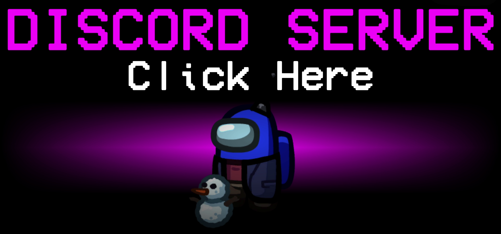

# Town Of Host

この README は英語版です。 
! We are not good at English, so if you have difficulty in making out, please translate Japanese README into English. ! 

## Regarding this mod

This mod is not affiliated with Among Us or Innersloth LLC, and the content contained therein is not endorsed or otherwise sponsored by Innersloth LLC. Portions of the materials contained herein are property of Innersloth LLC. © Innersloth LLC.

## Releases

**Latest Version: [Here](https://github.com/tukasa0001/TownOfHost/releases/latest)**

Old Versions: [Here](https://github.com/tukasa0001/TownOfHost/releases)

## Features

This mod only needs to be installed on the host's client to work, and works regardless of whether or not other client mods have been installed, and regardless of the type of terminal. 
Unlike mods that use custom servers, there is no need to add servers by editing URLs or files. 

However, please note that the following restrictions apply. 

- If the host changes due to factors such as a host leaving in the middle of a session, the processing related to the additional role may not work properly.

Note that if a player other than the host plays with this mod installed, the following changes will be made. 

- Display of the special role's own start screen.
- Display of the normal victory screen for the special role.
- Add additional settings.
- etc.

## Features
### Hotkeys

#### Host Only
| HotKey              | Function                       | Usable Scene    |
| ------------------- | ------------------------------ | --------------- |
| `Shift`+`L`+`Enter` | Force End Game                 | In Game         |
| `Shift`+`M`+`Enter` | Skip meeting to end            | In Game         |
| `Ctrl`+`N`          | Show active role descriptions  | Lobby&In Game   |
| `C`                 | Cancel game start              | In Countdown    |
| `Shift`             | Start the game immediately     | In Countdown    |
| `Ctrl`+`Delete`     | Set default all options        | In TOH Settings |
| `Ctrl`+`RMB`        | Execute clicked player         | In Meeting      |

#### MOD Client Only
| HotKey      | Function                                                               | Usable Scene |
| ----------- | ---------------------------------------------------------------------- | ------------ |
| `Tab`       | Option list page feed                                                  | Lobby        |
| `Ctrl`+`F1` | Output log to desktop                                                  | Anywhere     |
| `F11`       | Change resolution 480x270 → 640x360 → 800x450 → 1280x720 → 1600x900 | Anywhere     |
| `Ctrl`+`C`  | Copy the text                                                          | Chat         |
| `Ctrl`+`V`  | Paste the text                                                         | Chat         |
| `Ctrl`+`X`  | Cut the text                                                           | Chat         |
| `↑`         | Go back in time of chat send history                                   | Chat         |
| `↓`         | Go future in time of chat send history                                 | Chat         |

### Chat Commands
You can execute chat commands by typing in chat.

#### Host Only
| Command                                               | Function                                          |
| ----------------------------------------------------- | ------------------------------------------------- |
| /winner /win                                       | Show winner                                       |
| /rename <string> /r <string>                       | Change my name                                    |
| /dis <crewmate/impostor>                              | Ending the match as a Crewmate/Impostor severance |
| /messagewait <sec> /mw <sec>                       | Set message send interval                         |
| /help /h                                           | Show command description                          |
| /help roles <role> /help r <role>                  | Show role description                             |
| /help attributes <attribute> /help att <attribute> | Show attribute description                        |
| /help modes <mode> /help m <mode>                  | Show mode description                             |
| /help now /help n                                  | Show active setting descriptions                  |

#### MOD Client Only
| Command        | Function                    |
| -------------- | --------------------------- |
| /dump          | Dump log                    |
| /version /v | Show version of MOD clients |

#### All Clients
| Command                     | Function                                |
| --------------------------- | --------------------------------------- |
| /lastresult /l           | Show game result                        |
| /now /n                  | Show active settings                    |
| /now roles /n r          | Show active roles settings              |
| /template <tag> /t <tag> | Show template text corresponding to tag |

### Template
This function allows you to send prepared messages. 
Execute by typing `/template <tag>` or `/t <tag>`. 
To set the text, edit `template.txt` in the same folder as AmongUs.exe. 
Separate each entry with a colon, such as `tag:content`. 
Also, you can break lines by writing `\n` in the sentence like `tag:line breaks can be\nmade like this`. 

## Roles

| Impostors                           | Crewmates                         | Neutral                           |
| ----------------------------------- | --------------------------------- | --------------------------------- |
| [BountyHunter](#BountyHunter)       | [Bait](#Bait)                     | [Arsonist](#Arsonist)             |
| [Evil Watcher](#Watcher)            | [Dictator](#Dictator)             | [Egoist](#Egoist)                 |
| [FireWorks](#FireWorks)             | [Doctor](#Doctor)                 | [Executioner](#Executioner)       |
| [Mare](#Mare)                       | [Lighter](#Lighter)               | [Jester](#Jester)                 |
| [Puppeteer](#Puppeteer)             | [Mayor](#Mayor)                   | [Lovers](#Lovers)                 |
| [SerialKiller](#SerialKiller)       | [Nice Watcher](#Watcher)          | [Opportunist](#Opportunist)       |
| [ShapeMaster](#ShapeMaster)         | [SabotageMaster](#SabotageMaster) | [Terrorist](#Terrorist)           |
| [Sniper](#Sniper)                   | [Sheriff](#Sheriff)               | [SchrodingerCat](#SchrodingerCat) |
| [TimeThief](#TimeThief)             | [Snitch](#Snitch)                 |                                   |
| [Vampire](#Vampire)                 | [SpeedBooster](#SpeedBooster)     |                                   |
| [Warlock](#Warlock)                 | [Trapper](#Trapper)               |                                   |
| [Witch](#Witch)                     |                                   |                                   |
| [Mafia](#Mafia)                     |                                   |                                   |
| [Madmate](#Madmate)                 |                                   |                                   |
| [MadGuardian](#MadGuardian)         |                                   |                                   |
| [MadSnitch](#MadSnitch)             |                                   |                                   |
| [SidekickMadmate](#SidekickMadmate) |                                   |                                   |

### BountyHunter

Team : Impostors 
Decision : Impostor 

If the BountyHunters kill their designated target, their next kill cooldown will be much less than usual. 
Killing a player except their current target results in an increased kill cooldown. 
The target swaps after a configurable amount of time. 

#### Settings

| Settings Name                            |
| ---------------------------------------- |
| Time to swap Bounty(s)                   |
| Kill cooldown after killing Bounty(s)    |
| Kill cooldown after killing others(s)    |
| Kill cooldown other than BountyHunter(s) |

### FireWorks

Create and idea by こう。 

Team : Impostors 
Decision : Shapeshifter 

The FireWorks can set off fireworks and kill all at once.  
They can put a few fireworks by Shapeshift.   
After they put all the fireworks and after the other impostors are all gone, they can ignite all fireworks at once by Shapeshift.   
They can perform kills after setting off fireworks.  
Even if they mistakenly bomb themselves, killing everyone results in Impostor win.  

#### Settings

| Settings Name       |
| ------------------- |
| FireWorks Max Count |
| FireWorks Radius    |

### Mare

Create by Kihi, しゅー, そうくん, ゆりの 
Idea by Kihi

Team : Impostors 
Decision : Impostor 

They can kill only in lights out, but next kill cooldown will be half. 
While lights out they can move faster, and yet their name looks red by everyone. 

### Puppeteer

Team : Impostors 
Decision : Impostor 

They can perform secondhand kills but cannot kill like other Impostors. 
Their direct kill is protected, but instead, the protected player forcibly kills another player first getting in kill range. 

### SerialKiller

Team : Impostors 
Decision : Shapeshifter 

SerialKiller has even shorter kill cooldown. 
Unless taking a kill by deadline, they murder themselves instantly. 

| Settings Name            |
| ------------------------ |
| Kill cooldown(s)         |
| Time limit to suiside(s) |

### ShapeMaster

Create and idea by しゅー 

Team : Impostors 
Decision : ShapeShifter 

ShapeMaster has no Shapeshift cooldown. 
On the other hand, their default Shapeshift duration is shorter (default: 10s). 

#### Settings

| Settings Name          |
| ---------------------- |
| Shapeshift duration(s) |

### Sniper

Create and idea by こう。 

Team : Impostors 
Decision : Shapeshifter 

Sniper can shoot players so far away.  
they kill a player on the extension line from Shapeshift point to release point. 
Players on the line of bullet hear sound of a gunshot. 
You can perform normal kills after all bullets run out. 

Precision Shooting:OFF 
 
Precision Shooting:ON 
 

#### Settings

| Settings Name           |
| ----------------------- |
| Sniper bullet count     |
| Sniper precise shooting |

### TimeThief

Created by integral, しゅー, そうくん, ゆりの 
Idea by みぃー 

Team : Impostors 
Decision : Impostor 

Every kill of another player cuts down discussion and voting time in meeting. 
Depending on option, the lost time is returned after they die. 

#### Settings

| Settings Name                     |
| --------------------------------- |
| TimeThief Decrease Time Length(s) |
| Return Stolen Time after death    |

### Vampire

Team : Impostors 
Decision : Impostor 

The Vampires can bite players instead of kill. 
Bitten players die after a configurable amount of time or just before emergency meeting call. 
When biting the [Baits](#Bait), However, they take a no delay, normal kill and are forced to self report. 

#### Settings

| Settings Name         |
| --------------------- |
| Vampire Kill Delay(s) |

### Warlock

Team : Impostors 
Decision : Shapeshifter 

The Warlocks can curse another players before Shapeshift. 
When they Shapeshift after cursing, the player next to the cursed is killed no matter how far away they are. 

### Witch

Team : Impostors 
Decision : Impostor 

The Witches can perform kills or spells by turns. 
The players spelled by Witches before a meeting are marked "cross" in the meeting, and unless exiling Witches, They all die just after the meeting. 

### Mafia

Team : Impostors 
Decision : Impostor 

The Mafias can initially use vents and sabotage, but cannot kill (still have a button). 
They will be able to kill after Impostors except them are all gone. 

### Madmate

Team : Impostors 
Decision : Engineer 

The Madmates belong to team Impostors, but they don't know who are Impostors. 
Impostors don't know Madmates either. 
They cannot kill or sabotage, but they can use vents. 

### MadGuardian

Create and idea by 空き瓶/EmptyBottle 

Team : Impostors 
Decision : Crewmate 

The MadGuardians belong to team Impostors, one type of Madmates. 
Compared with Madmates, MadGuardian cannot use vents, while they can guard kills by Impostors after finishing all tasks. 

#### Settings

| Settings Name                           |
| --------------------------------------- |
| MadGuardian Can See Own Cracked Barrier |

### MadSnitch

Create and idea by そうくん 

Team : Impostors 
Decision : Crewmate or Engineer 

The MadSnitches belong to team Impostors, one type of Madmates. 
They can see who is the Impostor after finishing all their tasks. 
Depending on option, they can use vents. 

#### Settings

| Settings Name          |
| ---------------------- |
| MadSnitch Can Use Vent |
| MadSnitch Tasks        |

### SidekickMadmate

Create and idea by たんぽぽ 

Team : Impostors 
Decision : Undecided 

The SidekickMadmate is an acquired Madmate Role assigned by Impostors in task phases. 
Some kind of Shapeshifter-based Impostors can give SidekickMadmate by Shapeshifting next to a target. 

There is also common options for Madmate type Roles.

| Settings Name               |
| --------------------------- |
| Madmate can fix lights out  |
| Madmate can fix comms       |
| Madmate has Impostor vision |
| Madmate vent cooldown       |
| Madmate max time in vents   |

### Watcher

Team : Impostors or Crewmates 
Decision : Impostor or Crewmates 

The Watchers can see colored votes regardless of anonymous votes. 
There are both Impostor Roles (EvilWatcher) and Crewmate Roles (NiceWatcher). 

#### Settings

| Settings Name      |
| ------------------ |
| EvilWatcher Chance |

### Bait

Team : Crewmates 
Decision : Crewmate 

When the Baits are killed, they force the killer to self report in no time. 

### Dictator

Create and idea by そうくん 

Team : Crewmates 
Decision : Crewmate 

When you vote for someone in a meeting, they forcibly break that meeting and exile the player they vote for. 
After exercising the force, the Dictators die just after meeting. 

### Doctor

Team : Crewmates 
Decision : Scientist 

The Doctors have a portable vitals panel just like the vanilla Role Scientists. In addtion, the Doctors can see all causes of death in meetings. 

#### Settings
| Settings Name           |
| ----------------------- |
| Doctor battery duration |

### Lighter

Team : Crewmates 
Decision : Crewmate 

After finishing all the task, The lighters have their vision expanded and ignore lights out. 

#### Settings

| Settings Name                 |
| ----------------------------- |
| Lighter expanded vision       |
| Lighter gains Impostor vision |

### Mayor

Team : Crewmates 
Decision : Crewmate or Engineer 

The Mayors' votes count twice or more. 
Depending on the options, they can call emergency meeting by entering vents. 

#### Settings

| Settings Name                     |
| --------------------------------- |
| Mayor Additional Votes Count      |
| Mayor Has Mobile Emergency Button |
| Number Of Mobile Emergency Button |

### SabotageMaster

Create and idea by 空き瓶/EmptyBottle 

Team : Crewmates 
Decision : Crewmate 

The SabotageMasters can fix sabotage faster. 
they can fix both of Communications in MIRA HQ, Reactor and O2 by fixing either. 
Lights can be fixed by touching a single lever. 
Opening a door in Polus or The Airship will open all the linked doors. 

#### Settings

| Settings Name                                          |
| ------------------------------------------------------ |
| SabotageMaster Fix Ability Limit(Except Opening Doors) |
| SabotageMaster Can Open Multiple Doors                 |
| SabotageMaster Can Fix Both Reactors                   |
| SabotageMaster Can Fix Both O2                         |
| SabotageMaster Can Fix Both Communications In MIRA HQ  |
| SabotageMaster Can Fix Lights Out All At Once          |

### Sheriff

Team : Crewmates 
Decision : Impostor(Only host is the Crewmate) 

The Sheriffs can kill Impostors. 
They don't have tasks. 
If trying to kill the Crewmates, however, they will kill themselves instead. 
Whether or not they can kill Madmates or Neutrals is up to each option. 

#### Settings

| Settings Name                                                     |
| ----------------------------------------------------------------- |
| Sheriff Can Kill [Arsonist](#Arsonist)                            |
| Sheriff Can Kill [Jester](#Jester)                                |
| Sheriff Can Kill [Terrorist](#Terrorist)                          |
| Sheriff Can Kill [Opportunist](#Opportunist)                      |
| Sheriff Can Kill [Madmate](#Madmate)                              |
| Sheriff Can Kill [Egoist](#Egoist)                                |
| Sheriff Can Kill [SchrodingerCat](#SchrodingerCat) In Team Egoist |
| Sheriff Can Kill Crewmates As It                                  |
| Sheriff Shot Limit                                                |

### Snitch

Team : Crewmates 
Decision : Crewmate 

When finishing all the tasks, the Snitches can see arrows that point to the Impostors and their name looks red (only visible to the Snitch) (depending on the options also to Neutral killer). 
When the Snitches have one task left, they will be revealed to the Impostors (depending on the options also to Neutral killer) with an arrow pointing to the Snitches. 

#### Settings

| Settings Name                  |
| ------------------------------ |
| Snitch Can See Target Arrow    |
| Snitch Can Get Arrow Color     |
| Snitch Can Find Neutral Killer |

### SpeedBooster

Create and idea by よっキング 

Team : Crewmates 
Decision : Crewmate 

Completing the task will make a random surviving player speed up. 

#### Settings

| Settings Name     |
| ----------------- |
| Speed at speed up |

### Trapper

Created by そうくん 
Original idea by 宿主ランニング 

Team : Crewmates 
Decision : Crewmate 

When killed, it immobilizes the killed player for a few seconds. 

#### Settings

| Settings Name   |
| --------------- |
| Block Move Time |

### Arsonist

Team : Neutral 
Decision : Impostor 
Victory Conditions : Douse all alive crewmates 

When they use kill button and being close to target, they can douse oil to crewmate. 
If they finish dousing to all alive crewmates and enter vents, they will win. 

#### Settings

| Settings Name |
| ------------- |
| Dousing time  |
| Cooldown      |

### Egoist

Create by そうくん 
Original idea by しゅー 

Team : Neutral 
Decision : Shapeshifter 
Victory Conditions : Achieve the Impostor victory conditions after the Impostor annihilation. 

Impostor knows the egoist. 
Egoist also know Impostor. 
Impostor and Egoist cannot kill each other. 
You win when the other Impostor are wiped out. 
If the Egoist wins, the Impostor will be defeated. 

The conditions for defeat are as follows. 

1.Egoist dies. 
2.Imposter victory with allies remaining. 
3.Other Neutrals win. 

### Executioner

Team : Neutral 
Decision : Crewmate 
Victory Conditions : Target Voted Out 

The target is marked with a diamond that is visible only from here. 
If the vote expels the person with diamonds on his/her head, he/she wins alone. 
If the target is killed, the position changes. 
If the target is a jester, it wins an additional victory. 

### Jester

Team : Neutral 
Decision : Crewmate 
Victory Conditions : Get Voted Out 

The Jesters are the neutral role which can win by getting voted out. 
If the game ends without getting voted out., or if they are killed, they lose. 

### Opportunist

Team : Neutral 
Decision : Crewmate 
Victory Conditions : Aliving when one of the teams wins 

The Opportunists are the Neutral role, with an additional win if thay are still alive at the end of the game. 
They do not have tasks. 

### SchrodingerCat

Team : Neutral 
Decision : Crewmate 
Victory Conditions : None 

By default, it has no victory condition, and only when the condition is met does it have a victory condition. 

1.If you are killed by an Imposter, you prevent a kill and become an Imposter. 
2.If you are killed by a sheriff, you prevent a kill and become a crewmate. 
3.If you are killed by a neutral, you prevent the kill and become a neutral. 
4.If you are expelled, your position does not change and you die with the same victory conditions as before. 
5.If you are killed by a warlock's ability, the victory condition remains the same and you die. 
6.If a player is killed by suicide kills (except vampire kills), the victory condition remains the same and the player dies. 

Also common to all Schrodinger's cats, there are no tasks. 

#### Settings

| Settings Name                                              |
| ---------------------------------------------------------- |
| SchrodingerCat Before The Change CanWin As A Crewmate Team |
| SchrodingerCat Exiled Team Changes                         |

#### Settings

| Settings Name                               |
| ------------------------------------------- |
| Executioner Can be Target Impostor          |
| Executioner Change Role After Target Killed |

### Terrorist

Create and original idea by 空き瓶/EmptyBottle 

Team : Neutral 
Decision : Engineer 
Victory Conditions : Finish All Tasks, Then Die 

They are the Neutral role where they win the game alone if they die with all their tasks completed. 
Any cause of death is acceptable. 
If they die without completing their tasks, or if the game ends without they dying, they lose. 

## Attribute

### LastImpostor

Create and idea by そうくん 

This is the attribute given to the last Impostor. 
Not given to BountyHunter, SerialKiller, or Vampire. 

| Settings Name             |
| ------------------------- |
| LastImpostor KillCooldown |

### Lovers

Create and idea by ゆりの 

Team : Neutral 
Decision : - 
Victory Conditions : Alive at the end of the game. (other than task completion) 

Two of all players will be cast. (Duplicate to other positions)  
If a position with a crew camp task becomes a lover, the task will disappear.  
There is a heart symbol after each other's name.  
If one dies, the other will die afterwards.  
If the lover dies in the vote, the other will also die and become an unreportable corpse.  

Example of overlapping job titles:  
・ Terrorist lover: If you have a task and die after completing the task, you will win as a terrorist.  
・ Mad Snitch Lover: Have a task, and if you complete the task, you can see the Impostor.  
・ Snitch lover: No task, Impostor remains unknown.  
・ Sheriff Lover: You can kill Impostors as usual. Whether or not you can kill depends on the position of the duplicate source. (Impostor lover can be killed. Crewmate lover cannot be killed)  
・ Opportunist lover: Win if you survive.  
・ Jester Lover: If Jester Lover is banished, you will win as Jester. If the lover is banished by voting, Jester's lover is defeated.  
・ Bait lover: When the lover is killed and the bait lover dies afterwards, the lover immediately reports the bait lover.  

## SabotageTimeControl

The time limit for some sabotage can be changed.

| Settings Name             |
| ------------------------- |
| Polus Reactor TimeLimit   |
| Airship Reactor TimeLimit |

## Mode

### DisableTasks

It is possible to disable certain tasks. 

| Settings Name              |
| -------------------------- |
| Disable StartReactor Tasks |
| Disable SubmitScan Tasks   |
| Disable SwipeCard Tasks    |
| Disable UnlockSafe Tasks   |
| Disable UploadData Tasks   |

### HideAndSeek

Create and idea by 空き瓶/EmptyBottle 

#### Crewmates Team (Blue) Victory Conditions

Completing all tasks. 
※Ghosts's tasks are not counted. 

#### Impostor Team (Red) Victory Conditions

Killing all Crewmates. 
※Even if there are equal numbers of Crewmates and Impostors, the match will not end unless all the Crewmates have been wiped out. 

#### Fox (Purple) Victory Conditions

Aliving when one of the teams (Except Troll) wins. 

#### Troll (Green) Victory Conditions

Being killed by Impostors. 

#### Prohibited items

・Sabotage 
・Admin 
・Camera 
・The act of a ghosts giving its location to a survivor 
・Ambush (This may make it impossible for the Crewmates to win with the tasks.) 

#### What you can't do

・Reporting a dead bodies 
・Emergency conference button 
・Sabotage 

#### Settings

| Settings Name             |
| ------------------------- |
| Allow Closing Doors       |
| Impostors Waiting Time(s) |
| Ignore Cosmetics          |
| Ignore Using Vents        |

### NoGameEnd

#### Crewmates Team Victory Conditions

None 

#### Impostor Team Victory Conditions

None 

#### Prohibited items

None 

#### What you can't do

Exiting the game with anything other than host's SHIFT+L+Enter. 

This is a debug mode where there is no win decision. 

### RandomMapsMode

Created by つがる 

The RandomMapsMode changes the maps at random. 

#### Settings

| Settings Name     |
| ----------------- |
| Added The Skeld   |
| Added MIRA HQ     |
| Added Polus       |
| Added The Airship |

### SyncButtonMode

This is the mode in which all players' button counts are synchronised. 

#### Settings

| Settings Name    |
| ---------------- |
| Max Button Count |

## OtherSettings

| Settings Name  |
| -------------- |
| When Skip Vote |
| When Non-Vote  |

#### Client Settings

## Hide Codes

By activating, you can hide the lobby code.

You can rewrite the`Hide Game Code Name`in the config file (BepInEx\config\com.emptybottle.townofhost.cfg) to display any character you like when HideCodes are enabled.
You can also change the text color as you like by rewriting`Hide Game Code Color`.

## Force Japanese

Activating forces the menu to be in Japanese, regardless of the language setting.

## Japanese Role Name

By activating, the job title can be displayed in Japanese.
If the client language is English, this setting is meaningless unless `Force Japanese` is enabled.

## Credits

More tips to modding and [BountyHunter](#BountyHunter),[Mafia](#Mafia),[Vampire](#Vampire),[Witch](#Witch),[Bait](#Bait),[Mayor](#Mayor),[Sheriff](#Sheriff),[Snitch](#Snitch),[Lighter](#Lighter) idea by [The Other Roles](https://github.com/Eisbison/TheOtherRoles) 
[Opportunist](#Opportunist),[Watcher](#Watcher) original idea by [The Other Roles: GM Edition](https://github.com/yukinogatari/TheOtherRoles-GM) 
[SchrodingerCat](#SchrodingerCat) idea by [The Other Roles: GM Haoming Edition](https://github.com/haoming37/TheOtherRoles-GM-Haoming) 
[Doctor](#Doctor) original idea by [Nebula on the Ship](https://github.com/Dolly1016/Nebula) 
[Jester](#Jester) and [Madmate](#Madmate) original idea by [au.libhalt.net](https://au.libhalt.net) 
[Terrorist](#Terrorist)(Trickstar + Joker) : [Foolers Mod](https://github.com/MengTube/Foolers-Mod) 
[Lovers](#lovers) : [Town-Of-Us-R](https://github.com/eDonnes124/Town-Of-Us-R) 

Twitter : https://twitter.com/XenonBottle 

Translated with https://www.deepl.com 
