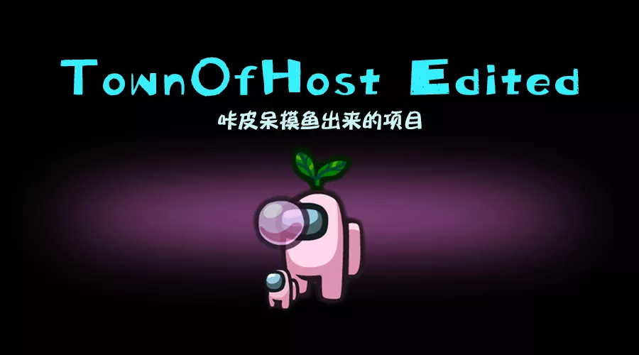
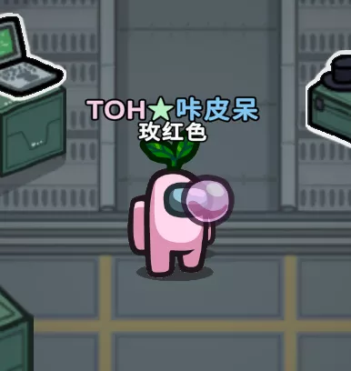
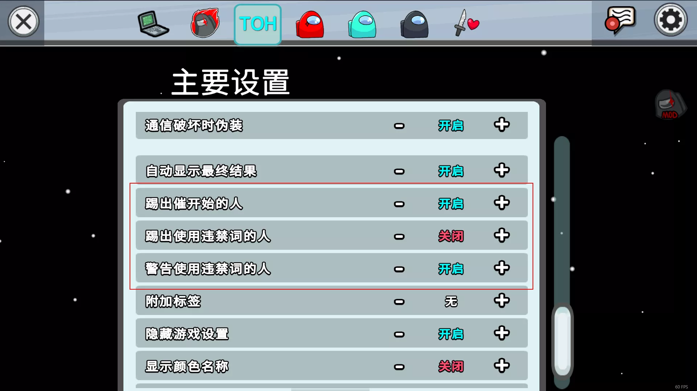
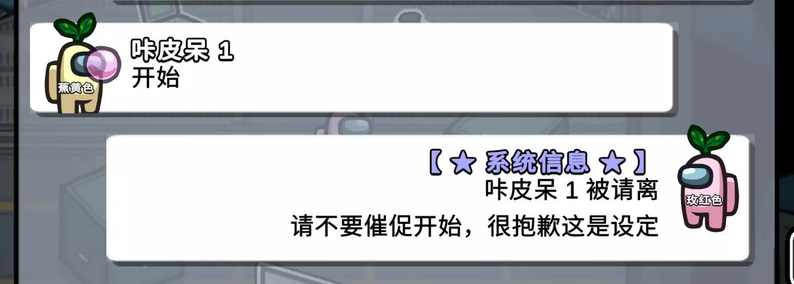
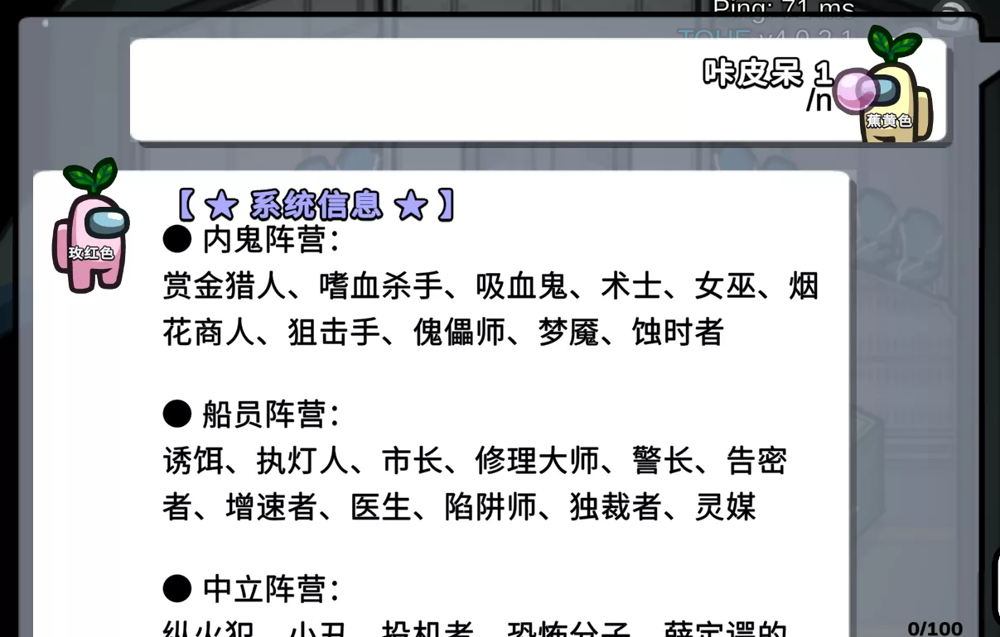

# Town Of Host Edited



## 关于这个模组

该模组不隶属于我们之中或 Innersloth LLC，其中包含的内容未经 Innersloth LLC 认可或以其他方式赞助。 此处包含的部分材料是 Innersloth LLC 的财产。 © Innersloth LLC。

---

## 资源

AmongUs 版本: **2022.12.14**

**最新版: [点我](https://github.com/KARPED1EM/TownOfHostEdited/releases/latest)**

官方原版: [点我](https://github.com/tukasa0001/TownOfHost/releases)

## 特点

一开始是为了帮群友解决模组损坏的问题，于是我从零摸索C语言，成功地解决这个问题后顺带加了点功能并修改了一些内容，于是有了这个版本并命名为 **Town Of Host Edited** 也就是 **TOHE**。

这个模组存在的本质意义是让我学习一些新的知识，所以我并不会及时地更新他。等我学习完成或退游后就会断更了。这是我第一次使用C语言，因此这个修改版的代码会很烂，并且可能伴随大量的Bug。这也是因为我并没有同伴协助我开发或测试，所有的开发均由我一人完成。因此我很抱歉给您带来了糟糕的游戏体验。当然如果您愿意使用我修改的版本，我非常感激！若您在使用过程中遇到问题或有什么意见，非常欢迎您提个 issue，或者是通过 **[QQ群：134830517](https://jq.qq.com/?_wv=1027&k=CBkjGf2Y)** 来联系我。

---

## 内容更新

### 1. 删除对原版客户端的非必要提示

### 2. 强制更新检查结果为成功以避免模组损坏，所以接下来请您及时注意是否有新版本发布

### 3. 游戏结果显示的顺序微调

### 4. 房主公开房间后的名称显示微调

   

### 5. 增加自动警告或踢出使用违禁词的人的功能，可以在`./TOH_DATA/bannedwords.txt`自定义违禁词

   

### 6. 增加自动踢出催开始的人的功能，需要在设置打开，如上图所示

   

### 7. 隐藏游戏设置后自定义显示的内容，您可以在 `.\Language\SChinese.dat` 文件中修改 `Message.NowOverrideText` 词条。

   

### 8. 增加修改等级的指令（仅限房主）

```聊天指令
#示例：修改等级为86级
/level 86
```

### 9. 简化部分指令

```聊天指令
#处决玩家
/exe
#房主消息
/s
```

### 10. 修改使查询职业技能可以使用中文

```聊天指令
#示例：查询术士的技能描述
/r 术士
```

### 11. 汉化部分没有中文的文本

### 12. 让100%概率的职业随机出现（不完全实现）

### 13. 修改部分汉化使翻译更合适

### 14. 更新至官方最新提交 #1241 以修复部分Bug

### 15. 增加或修改可用快捷键（以下）

|      快捷键       |          功能          |   权限   |
| :---------------: | :--------------------: | :------: |
| Shitf + M + Enter |        远程拍灯        | 仅限房主 |
| Shitf + R + Enter |        强制拍灯        | 仅限房主 |
| Shitf + O + Enter | 一键完成所有自己的任务 | 仅限房主 |
| Shitf + K + Enter |    修改击杀CD为0秒     | 仅限房主 |
| Shitf + E + Enter |  自杀（可能造成Bug）   | 仅限房主 |
| Shitf + D + Enter |  打开飞艇地图的所有门  | 仅限房主 |
| Shitf + V + Enter |      关闭匿名投票      | 仅限房主 |

---

## 角色修改

### 1. 增速者（船员阵营）

增速者现在只会给自己加速，每次完成任务都会增加设定好的移动速度。

|           设置参数           | 默认值 |
| :--------------------------: | :----: |
| 增速者每次完成任务增加的速度 |  0.2x  |
|        最多能增加几次        |  5次   |

---

## 角色新增

### 1. 被害妄想症（船员阵营）

被害妄想症可以随时使用通风管道，但使用通风管道后，被害妄想症会幻想出一具尸体并报告。该技能实际上不会造成死人，但可以召开会议。

### 2. 矿工（内鬼阵营）

矿工变形以及解除变形的时候会传送至上一个进入的通风口。

### 3. 愚者（船员阵营）
愚者能够在会议期间看到潜在的邪恶。每次会议愚者将看到数名玩家的名字以红色突出显示，其中至少一名是邪恶的。

|       设置参数       | 默认值 |
| :------------------: | :----: |
| 可以看到几位红名玩家 |   4    |
|  带刀船员显示为红色  |  开启  |
|  友善中立显示为红色  |  开启  |
|  邪恶中立显示为红色  |  开启  |

### 4. 工程师（船员阵营）

工程师可以无限制使用管道，并可以永远呆在管道里。

### 5. 摆烂人（船员阵营）

摆烂人只有一个任务。另外，摆烂人不会被术士诅咒、不会被傀儡师操控、不会成为处刑人的目标、不会成为骇客的替罪羊。

### 6. 大明星（船员阵营）

会议期间，大明星名字旁会显示一个金色的星星，仅此而已。

|       设置参数       | 默认值 |
| :------------------: | :----: |
| 所有人知道谁是大明星 |  开启  |

### 7. 骇客（内鬼阵营）

当骇客完成击杀后，会随机选择除自己外的一名存活玩家报告被害者的尸体。若找不到当替罪羊的玩家，骇客就会自己报告尸体。注意：摆烂人不会成为骇客的替罪羊。