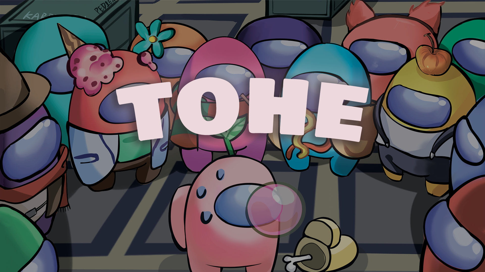

<h1 align="center">~ TownofHost Edited ~</h1>

 

 

  
> ### Regarding this mod
>
> This mod is not affiliated with Among Us or Innersloth LLC, and the content contained therein is not endorsed or otherwise sponsored by Innersloth LLC. Portions of the materials contained herein are property of Innersloth LLC. © Innersloth LLC.
>

####  :bookmark_tabs: 更多信息请移步：[**tohe.cc**](https://tohe.cc)
####  :zap: Discord：[**Click Here**](https://discord.gg/5PNwUaN5)
####  :sparkles: Latest Version：[点我](https://github.com/KARPED1EM/TownOfHostEdited/releases/latest)

---

**This is a project for me to learn C#.**

**So many thanks to these mods for their codes and helps:**

> 
### :star: [TOH](https://github.com/tukasa0001/TownOfHost) :
> 
> - Our repo is forked from TOH
> 
### :star: [TOHY](https://github.com/Yumenopai/TownOfHost_Y) :
> 
> - Many role ideas
> - Provided role: AntiAdminer, CursedWolf, Workaholic, Greedier, DarkHide
> - Reference: Modify game announcement
> 
### :star: [TOH:TOR](https://github.com/music-discussion/TownOfHost-TheOtherRoles) :
> 
> - Many role ideas
> - Reference: Exile Confirm
> - Reference: Split RPC Pack
> 
### :star: [SNR](https://github.com/ykundesu/SuperNewRoles) :
> 
> - Reference: Credentials menu
> - Reference: Switch Horse Mode
> - Reference: Search Mod Game
>
### :star: [TOP](https://github.com/tugaru1975/TownOfPlus) :
> 
> - Reference: Zoom
> 
### :star: [RHR](https://github.com/sansaaaaai/Revolutionary-host-roles) :
> 
> - Reference: Modify settings menu
> 
