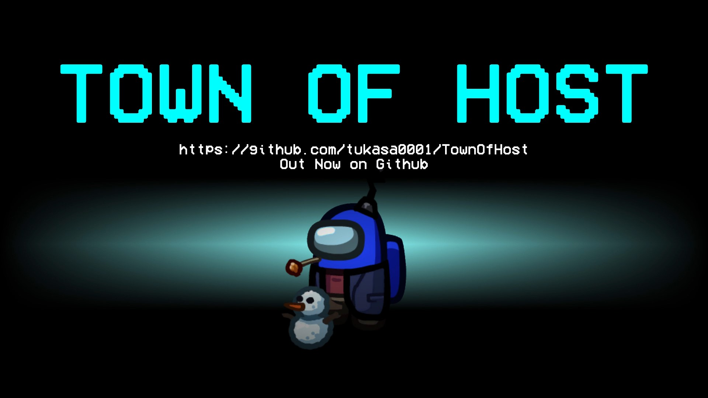

# Town Of Host For E

## この Mod について

この Mod は非公式のものであり、この Mod の開発に関して Among Us の開発元である"Innersloth"は一切関与していません。 
この Mod の問題などに関して公式に問い合わせないでください。 
また本Mod で発生した不具合について、本家TOH及びTOHY開発者様に問い合わせないでください。 

## リリース

AmongUsバージョン : **2022.12.14**

**本家最新版は[こちら](https://github.com/tukasa0001/TownOfHost/releases/latest)** 
**そこから派生され、TOH4Eの元となったTOHYの最新版は[こちら](https://github.com/Yumenopai/TownOfHost_Y/releases/latest)** 

TOH過去バージョンは[こちら](https://github.com/tukasa0001/TownOfHost/releases)

## TOH4Eの特徴('ω')ノ

このModは本家**TownOfHost** Modから派生された**TownOfHost_Y**の仕様はそのままに追加のオリジナル役職を入れたものです。

正直に申しますと他の制作者様のような目立った新機能は入れておらず、本当にオリジナル追加役職のみです。はい。
何か思いついたら入れるかもですが、これを読まれているタイミングで編集されていないということはまだ追加役職のみです。

ただ、ただね
TownOfHost ForEでは個性豊かなオリジナル役職を実装していきます。
それはきっとここだけでしか遊べない独特なAmongUs体験になることをお約束します。

TownOfHost ForEの目標はただ一つ。
他のAmongUsでは味わえない、パーティゲームのようなゲーム体験が出来ることです。
エンジョイ系のAmongUsが好きな方に是非ともプレイして頂ければと思います。 

※最新バージョンは安定版となります。時期追加役職の詳細や、体験は是非[**YouTube**](https://t.co/aTr8zfSaGW)まで！

TownOfHost ForEは本家同様ホストのクライアントに導入するだけで動作し、他のクライアントの Mod の導入/未導入及び端末の種類に関係なく動作します。 

## 遊ぶ際のご注意！
- 本家TOH及び、TOHYなど、他MODを入れた方と遊ぶ場合の動作は保証しません。てかやめてください。お願いします。
- TOH4Eの追加役職は一応英語、中国語に対応しておりますが、外部翻訳サイトに頼ってます。色々翻訳間違ってたらごめんなさい。
- 役職の説明はTOH4Eで追加したもの、もしくは設定を更新したもののみ記載します。他は恐らくリンクとか貼ってるかもなので該当ページで確認してください。
- その他、注意事項はTOH,TOHYに則ります。

## ★新設定

<<<<<<< HEAD
### 勝利陣営予想投票モード
=======
###勝利陣営予想投票モード
>>>>>>> cf5731cfc416fb1efa860bc2e50d7d034658b2bb

キル、吊りなどで死んでしまった場合に有効になる機能です。設定欄から有効にすることで利用できます。 
コマンドを入力することで勝利陣営を予想して投票することが出来ます。 
投票後、一番投票数を集めた陣営はリザルトに表示されます。 

今後アップデート予定です。 

| チャットコマンド | 機能
|/Bet <陣営名> /b <陣営名>|勝利陣営を予想

## ★役職

| インポスター陣営                                                    							 | マッドメイト                                                            										   | クルーメイト陣営                                          											 | 第三陣営                                                   										   | アニマルズ  						  												 |その他属性等  						  												 |
| -----------------------------------------------------------------------------------------------| --------------------------------------------------------------------------------------------------------------- | --------------------------------------------------------------------------------------------------- | --------------------------------------------------------------------------------------------------- | ----------------------------------------------------------------------------------- |----------------------------------------------------------------------------------- |
| [バウンティハンター](https://github.com/tukasa0001/TownOfHost#BountyHunterバウンティハンター)  |  [マッドメイト](https://github.com/tukasa0001/TownOfHost#Madmateマッドメイト)                                   | [ベイト](https://github.com/tukasa0001/TownOfHost#Baitベイト)                                       | [アーソニスト](https://github.com/tukasa0001/TownOfHost#Arsonistアーソニスト)                       | [コヨーテ](#コヨーテ)																 |[GM](https://github.com/tukasa0001/TownOfHost#GM)									 |
| [イビルトラッカー](https://github.com/tukasa0001/TownOfHost#EvilTrackerイビルトラッカー)       |  [マッドガーディアン](https://github.com/tukasa0001/TownOfHost#MadGuardianマッドガーディアン)                   | [ディクテーター](https://github.com/tukasa0001/TownOfHost#Dictatorディクテーター)                   | [エゴイスト](https://github.com/tukasa0001/TownOfHost#Egoistエゴイスト)                             | [バルチャー](#バルチャー)															 |[ラストインポスター](https://github.com/Yumenopai/TownOfHost_Y#ラストインポスター)  |
| [イビルウォッチャー](https://github.com/tukasa0001/TownOfHost#Watcherウォッチャー)             |  [マッドスニッチ](https://github.com/tukasa0001/TownOfHost#MadSnitchマッドスニッチ)                             | [ドクター](https://github.com/tukasa0001/TownOfHost#Doctorドクター)                                 | [エクスキューショナー](https://github.com/tukasa0001/TownOfHost#Executionerエクスキューショナー)    | [アナグマ](#アナグマ)													 			 |[ウォッチング](https://github.com/Yumenopai/TownOfHost_Y#ウォッチング) 			 |
| [花火職人](#FireWorks花火職人)                                     						     |  [サイドキックマッドメイト](https://github.com/tukasa0001/TownOfHost#SidekickMadmateサイドキックマッドメイト)   | [ライター](https://github.com/tukasa0001/TownOfHost#Lighterライター)                                | [ジャッカル](https://github.com/tukasa0001/TownOfHost#Jackalジャッカル)                             | [ブラキディオス](#ブラキディオス)													 |[ライティング](https://github.com/Yumenopai/TownOfHost_Y#ライティング)				 |
| [メアー](https://github.com/tukasa0001/TownOfHost#Mareメアー)                                  |  [マッドディクテーター](https://github.com/Yumenopai/TownOfHost_Y#マッドディクテーター)                         | [メイヤー](https://github.com/tukasa0001/TownOfHost#Mayorメイヤー)                                  | [ジェスター](https://github.com/tukasa0001/TownOfHost#Jesterジェスター)                             | 																					 |[サングラス](https://github.com/Yumenopai/TownOfHost_Y#サングラス)					 |
| [パペッティア](https://github.com/tukasa0001/TownOfHost#Puppeteerパペッティア)                 |  [マッドネイチャコール](https://github.com/Yumenopai/TownOfHost_Y#マッドネイチャコール)                         | [ナイスウォッチャー](https://github.com/tukasa0001/TownOfHost#Watcherウォッチャー)                  | [ラバーズ](https://github.com/tukasa0001/TownOfHost#Lovers恋人)                                     | 																					 |[シーイング](https://github.com/Yumenopai/TownOfHost_Y#シーイング)					 |
| [シリアルキラー](https://github.com/tukasa0001/TownOfHost#SerialKillerシリアルキラー)          |  [マッドブラックアウター](https://github.com/Yumenopai/TownOfHost_Y#マッドブラックアウター)                     | [サボタージュマスター](https://github.com/tukasa0001/TownOfHost#SabotageMasterサボタージュマスター) | [オポチュニスト](https://github.com/tukasa0001/TownOfHost#Opportunistオポチュニスト)                |																					 |[オートプシー](https://github.com/Yumenopai/TownOfHost_Y#オートプシー) 			 |
| [スナイパー](https://github.com/tukasa0001/TownOfHost#Sniperスナイパー)                        |  [マッドシェリフ](https://github.com/Yumenopai/TownOfHost_Y#マッドシェリフ)                                     | [シーア](https://github.com/tukasa0001/TownOfHost#Seerシーア)                                       | [テロリスト](https://github.com/tukasa0001/TownOfHost#Terroristテロリスト)                          |																					 |[VIP](https://github.com/Yumenopai/TownOfHost_Y#VIP)  								 |
| [タイムシーフ](https://github.com/tukasa0001/TownOfHost#TimeThiefタイムシーフ)                 |                                                                     										       | [シェリフ](https://github.com/tukasa0001/TownOfHost#Sheriffシェリフ)                                | [シュレディンガーの猫](https://github.com/tukasa0001/TownOfHost#SchrodingerCatシュレディンガーの猫) |																					 |[クラムシー](https://github.com/Yumenopai/TownOfHost_Y#クラムシー)					 |
| [ヴァンパイア](https://github.com/tukasa0001/TownOfHost#Vampireヴァンパイア)                   |  																											   | [スニッチ](https://github.com/tukasa0001/TownOfHost#Snitchスニッチ)                                 | [アンチコンプリート](https://github.com/Yumenopai/TownOfHost_Y#アンチコンプリート)                  |																					 |[リベンジャー](https://github.com/Yumenopai/TownOfHost_Y#リベンジャー)				 |
| [ウォーロック](https://github.com/tukasa0001/TownOfHost#Warlockウォーロック)                   |  																											   | [スピードブースター](https://github.com/tukasa0001/TownOfHost#SpeedBoosterスピードブースター)       | [ワーカホリック](https://github.com/Yumenopai/TownOfHost_Y#ワーカホリック)　                        |																					 |[マネジメント](https://github.com/Yumenopai/TownOfHost_Y#マネジメント)				 |
| [魔女](https://github.com/tukasa0001/TownOfHost#Witch魔女)                                     | 																	    										   | [トラッパー](https://github.com/tukasa0001/TownOfHost#Trapperトラッパー)                            | [ダークハイド](https://github.com/Yumenopai/TownOfHost_Y#ダークハイド)                              |																					 |[ワークホース](https://github.com/Yumenopai/TownOfHost_Y#ワークホース)	          	 |
| [マフィア](https://github.com/tukasa0001/TownOfHost#Mafiaマフィア)                             |   																											   | [ハンター](https://github.com/tukasa0001/TownOfHost#ハンター)                                       | [ラブカッター](https://github.com/Yumenopai/TownOfHost_Y#ラブカッター)                              |																					 |[インフォプアー](https://github.com/Yumenopai/TownOfHost_Y#インフォプアー)	         |
| [アンチアドミナー](https://github.com/Yumenopai/TownOfHost_Y#アンチアドミナー)                 |    																											   | [タスクマネージャー](https://github.com/tukasa0001/TownOfHost#タスマネ)                        	 | [純愛者](https://github.com/Yumenopai/TownOfHost_Y#純愛者)                                          |																					 |[タイブレーカー](https://github.com/Yumenopai/TownOfHost_Y#タイブレーカー)	         |
| [イビル猫又](https://github.com/Yumenopai/TownOfHost_Y#イビル猫又)                             |   																											   | [パン屋](https://github.com/Yumenopai/TownOfHost_Y#パン屋)                                        	 | [弁護士](https://github.com/Yumenopai/TownOfHost_Y#弁護士)                                          |																					 |[ノンレポート](https://github.com/Yumenopai/TownOfHost_Y#ノンレポート)	          	 |
| [呪狼](https://github.com/Yumenopai/TownOfHost_Y#呪狼)                                         |    																											   | [エクスプレス](https://github.com/Yumenopai/TownOfHost_Y#エクスプレス)                              | [クライアント](https://github.com/Yumenopai/TownOfHost_Y#クライアント)                              |																					 |[センディング](https://github.com/Yumenopai/TownOfHost_Y#センディング)	          	 |
| [グリーディア](https://github.com/Yumenopai/TownOfHost_Y#グリーディア)                         |    																											   | [チェアマン](https://github.com/Yumenopai/TownOfHost_Y#チェアマン)                                  | [トトカルチョ](#トトカルチョ)   			                   										   |																					 |[ロイヤルティ](https://github.com/Yumenopai/TownOfHost_Y#ロイヤルティ)	         	 |
| [アンビショナー](https://github.com/Yumenopai/TownOfHost_Y#アンビショナー)                     |																												   | [★にじいろスター★](https://github.com/Yumenopai/TownOfHost_Y#にじいろスター)                      | [姫](#姫)                                                   										   |																					 |[プラスポート](https://github.com/Yumenopai/TownOfHost_Y#プラスポート)	         	 |
| [スカベンジャー](https://github.com/Yumenopai/TownOfHost_Y#スカベンジャー)                     |																												   | [猫又](https://github.com/Yumenopai/TownOfHost_Y#猫又)                                              | [義賊](#義賊)																					   |																					 |[ガーディング](https://github.com/Yumenopai/TownOfHost_Y#ガーディング)	         	 |
| [イビルディバイナー](https://github.com/Yumenopai/TownOfHost_Y#イビルディバイナー)             |																												   | [見送り人](https://github.com/Yumenopai/TownOfHost_Y#見送り人)                            			 |                                                             										   |																					 |[ベイティング](https://github.com/Yumenopai/TownOfHost_Y#ベイティング)	         	 |
| [テレパシスターズ](https://github.com/Yumenopai/TownOfHost_Y#テレパシスターズ)                 |																												   | [バカシェリフ](https://github.com/Yumenopai/TownOfHost_Y#バカシェリフ)                              |                                                             										   |																					 |[リフュージング](https://github.com/Yumenopai/TownOfHost_Y#リフュージング)	         |
| [シェイプキラー](https://github.com/Yumenopai/TownOfHost_Y#シェイプキラー)					 |																												   | [共鳴者](https://github.com/Yumenopai/TownOfHost_Y#共鳴者)                                          |                                                             										   |																					 |[コンプリートクルー](https://github.com/Yumenopai/TownOfHost_Y#コンプリートクルー)  |
| [爆裂魔](#爆裂魔)	                                       			  							 |																												   | [ブラインダー](https://github.com/Yumenopai/TownOfHost_Y#ブラインダー)                              |                                                             										   |          																		     |[中二病](#中二病)																		     |
| [シンデレラ](#シンデレラ)	                                                       	 			 |																												   | [メディック](https://github.com/Yumenopai/TownOfHost_Y#メディック)                                  |                                                             										   |           																		     |          																		     |
|                                                       			  							 |																												   | [キャンドルライター](https://github.com/Yumenopai/TownOfHost_Y#キャンドルライター)       			 |                                                             										   |           																		     |          																		     |
|                                       			  											 |																												   | [占い師](https://github.com/Yumenopai/TownOfHost_Y#占い師)                  				         |                                                             										   |          																		     |         																		     |
|                                                       			  							 |																												   | [霊媒師](https://github.com/Yumenopai/TownOfHost_Y#霊媒師)            			                     |                                                             										   |           																		     |          																		     |
|                                                       			  							 |																												   | [お嬢様](#お嬢様)                                  												 |                                                             										   |           																		     |          																		     |
|                                                       			  							 |																												   | [ネゴシエーター](#ネゴシエーター)                                  								 |                                                             										   |           																		     |          																		     |

### FireWorks/花火職人

制作・考案者 : こう。 

陣営 : インポスター 
判定 : シェイプシフター 

花火の爆破によって大量キル出来る役職です。 
最大3個の花火をシェイプシフトのタイミングで設置出来ます。 
すべての花火を設置したら、最後のインポスターとなった時にシェイプシフトのタイミングで一斉起爆します。 
花火を設置し始めてから爆破するまでキル出来ません。 
自身が爆破に巻き込まれても全滅させることが出来た場合は勝利となります。 
TOH4Eでは爆破するまでキルできない制限と、 
生きているインポスターがいると花火を打ち上げられない制限をを解除できます。

#### 設定

| 設定名         |
| -------------- |
| 花火の所持数   |
| 花火の爆発半径 |
| 花火を打ち上げなくてもキルが出来る |
| 他にインポスターが生きている場合でも花火を打ち上げられる |

### 爆裂魔

陣営 : インポスター 
判定 : シェイプシフター 

￡(*`・ω・）/☆*。;+， ｴｸｽﾌﾟﾛｰｼﾞｮﾝ!!! 
1度だけ爆裂魔法によって大量キル出来る役職です。 
任意のタイミングで変身を行うことで自身の近くにいるクルーをキルできます。 
この爆裂魔法に自身は巻き込まれませんが、発動後は数秒動けなくなります。 
また発動後はキルを行っても相手はキルされず、自身のみ自爆します。 
更に爆裂魔法範囲にインポスターがいる場合も巻き込みます。 
そのため発動タイミングはご注意を。 
追加設定で爆裂魔法後のキル行為でサイドキックマッドメイトも指名できるよ☆

#### 設定

| 設定名         |
| -------------- |
| 自爆の爆発半径   |
| マッドメイトを指名できる |
| 移動を封じる時間 |
| 爆裂中にベントに潜れる |

### シンデレラ

発案者 : 依存症 

陣営 : インポスター 
判定 : シェイプシフター 

早く、早く、変身が解ける前に！ 
変身をしなければキルが出来ないインポスター。 
但し変身後は移動が速く、変身した対象がどこにいるのかを通知してくれる。 

#### 設定

| 設定名         |
| -------------- |
| 変身時の移動速度  |
| 変身時間 |

### お嬢様

発案者 : たけのこ部屋 

陣営 : クルーメイト 
判定 : クルーメイト 

チャットで会話をすると正体がバレる役職です。 
タスクを完了することでキル可能な人外とすれ違った場合、通知を受けることが出来ます。 
しかしながらお嬢様のタスクが少なくなるとキル可能人外に居場所がバレます。 
キルされる際、一定確率でキルを無効にし、キルを行った陣営になります。 
チャットで行えるアモアスだからこそ輝く役職かと思うので、是非お試しあれ。

#### 設定

| 設定名         |
| -------------- |
| 人外通知能力 |
| キルされたときに寝返る確率 |
| 通知の半径 |
| 通知上限 |
| キル役職に居場所がバレるタスク数 |

### ネゴシエーター

陣営 : クルーメイト 
判定 : エンジニア 

タスク後にベントを利用してターゲットを選択後、 
そのターゲットに近づくとインポスター以外であればクルーメイトにすることが出来る。 
上手く使えば有利になるが、シェリフとかに当たると可哀想である。 

#### 設定

| 設定名         |
| -------------- |
| キルクールダウン |

### 姫

陣営 : 第三（単独） 
判定 : インポスター 
カウント : クルー 
勝利条件 : 1人以上を恋人にした上で恋人以外がいなくなること。全クルーのタスク終了時は生き残っていても敗北。 

純愛者同様誰かに向かってキルボタンを押すことで、その人と共にラバーズ(属性)になれます。 
ラバーズの仕様は通常ラバーズと全く同じです。 
但し恋人になる上限は設定値次第です。船の皆と恋人になることも夢じゃない。 
ターン毎に1回目のキル後、2回目のキルクールは設定値の半分になります。 
※純愛者、ラバーズと一緒に入れないでください。 

#### 設定
| 設定名         |
| -------------- |
| 彼ピの数 |
| 勝利を追加勝利にする |
| キルクール |

### 義賊

陣営 : 第三（単独） 
判定 : インポスター 
カウント : クルー 
勝利条件 : 一定数のキル役職をキルする。 

通常はキルが出来ないキル役職です。
ペットボタンを押すことで任意の場所に罠を仕掛けます。ペット可愛いね。 
罠の上をキル役職が通るとそのプレイヤーにキルクールを与え、代わりに1度だけキルが可能になります。 
罠は1度だけ有効です。誰かが引っかかった場合はキル後にでも設置し直すといいでしょう。 

#### 設定
| 設定名         |
| -------------- |
| 罠の半径 |
| キルしなきゃいけないキル役職の人数 |

### コヨーテ

陣営 : アニマルズ 
判定 : インポスター 
勝利条件 : インポスター、ジャッカルを全滅させ、アニマルズの人数がクルーの人数と同数か上回ること 

他のすべてのプレイヤーを排除することで勝利するアニマルズの役職です。 
タスクがなく、インポスター、クルー、ニュートラルをキルすることができます。 

#### 設定
| 設定名         |
| -------------- |
| キルクール |
| ベントを使える |
| サボタージュを使用できる |
| インポスター視界 |

### バルチャー

陣営 : アニマルズ 
判定 : エンジニア 
勝利条件 : 死体を規定数食べること 

死体を通報することで死体を食べた判定をさせてます。 
死体はなくなりませんが、通報しても会議にはならず、その死体は誰も通報できなくなります。 
タスクを全て行うことで、死体の場所が分かるようになるのでタスクも頑張ろうね 

#### 設定
| 設定名         |
| -------------- |
| 食べなくちゃいけない死体の数 |
| バルチャーのタスクを上書きする(1以上) |

### アナグマ

陣営 : アニマルズ 
判定 : エンジニア 
勝利条件 : 規定数のプレイヤーを穴に落としてキルすること 

ペットボタンを押すことで任意の場所に穴を仕掛けます。ペット可愛いね。 
穴の上は数回歩くことで深くなり、最後に踏んだプレイヤーは奈落に落ちてキルされます。 
1つの穴で1人までキルできるので、誰かをキルした後は新しい穴を掘りましょう。 

#### 設定
| 設定名         |
| -------------- |
| 落とし穴の半径 |
| 踏まれる回数 |
| 落とす人数 |

### ブラキディオス

陣営 : アニマルズ 
判定 : インポスター 
勝利条件 :インポスター、ジャッカルを全滅させ、アニマルズの人数がクルーの人数と同数か上回ること 

任意の相手にキルボタンを押下することで粘菌を塗りたくります。 
粘菌を塗りたくられたプレイヤーは気づけませんが、以下の条件で爆発します。 
・死体を通報した 
・ミーティングボタンを押した 
・ブラキディオスが新しく粘菌を塗った 
爆発に巻き込まれたプレイヤーはキルされます。ブラキディオスのみ爆発に巻き込まれても死ぬことはありません。 
モンスターだからね。

### 中二病

・属性 
議論中に以下のワードを入力すると続く文字が出現する。 
「暗黒の魔力よ我が身に宿りし時」 
全てのワードを入力後、なんか英語っぽい文字が出たら準備完了。 
[ディクテーター](https://github.com/tukasa0001/TownOfHost#Dictatorディクテーター)の能力が顕現し、投票すると確実に相手を吊ることが出来る。 

## クレジット
- 自爆魔[SNR](https://github.com/ykundesu/SuperNewRoles)：当初実装しようとしたもの。この役職考えた人は天才。
## 開発者
<!--
開発者用チャンネルでの一番最初の発言が早い順に記載する。
- [テンプレ](https://github.com/) ([Twitter](https://twitter.com/))
- [Twitter以外のページでも可](https://github.com/) ([Twitter](https://twitter.com/), [TheOtherPages](https://example.com/))
- [何もなくていい場合は消してOK](https://github.com/)
注：README-ENへの追記を忘れないでください。
-->
- [紅熊明日夢](https://github.com/AsumuAkaguma) ([Twitter](https://twitter.com/Akaguma_PG))([TOH4E情報発信Twitter](https://twitter.com/TOH4E_AmongUs)) ([ようつべ](https://t.co/aTr8zfSaGW))
- 他、TOH開発者、TOHYのyumeno様等に関しましては省略しますmm
